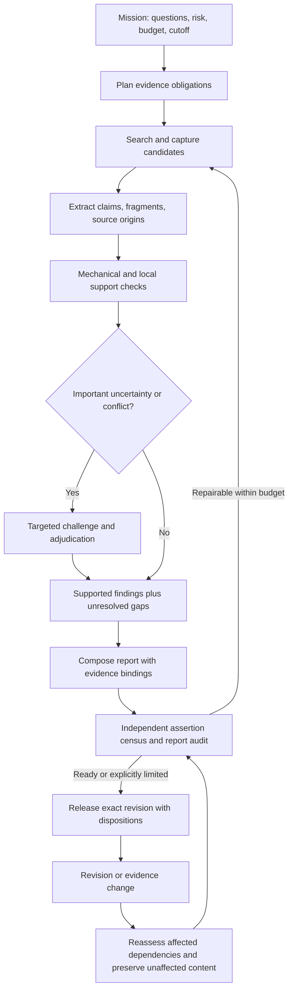

# Evidence that earns its cost: a proposal for trustworthy deep research

**Status: PROPOSED — for review and promotion. No implementation or operational approval is implied.**

Research cutoff: 27 September 2026, America/New_York. Prepared using public primary sources, benchmark methods, product documentation, and the earlier accountable-evidence research. All budgets, requirements, experiments, and acceptance targets below are proposals; none are measured results for this workspace.

The decision requested is to approve a measured research and evaluation program, then select an evidence policy from its results. The recommendation is independent of the present verification module. A final section maps it to workspace owners without treating existing capabilities as evidence that the strategy works.

Read this document for the strategy and proposed operating specification. [Evaluation protocol](evaluation-protocol.md) supplies metric definitions, experimental arms, budgets, and promotion criteria. [Source register](sources.md) records the evidence and its limits. The [benchmark research notes](benchmark-research-notes.md) and [verification economics notes](cost-research-notes.md) provide deeper supporting analysis.

## 1. Executive recommendation

Build deep research around **an explicit record of what is being claimed, the evidence supporting it, and what remains uncertain**. Keep that record through retrieval, analysis, agent handoffs, report writing, revision, and later reuse. Verify the final report as well as important intermediate transformations. A correct research note can become an incorrect conclusion when its population, timeframe, caveat, or citation disappears during synthesis.

Use **universal basic checks with selective expensive investigation**. Every retained, externally checkable assertion in an official report should receive an evidence disposition and a source-support check, with deterministic checks for locators, numbers, and computations where possible. Spend additional searches, stronger or independent judges, and human attention on claims that could change a decision, support many downstream conclusions, involve uncertain interpretation, or face conflicting evidence. Keep sampled audits of apparently easy passes so the routing policy cannot hide its own mistakes.

The success criterion is **more useful, adequately supported answers for the resources spent**, subject to an acceptable risk of releasing unsupported claims. It is not the number of sources, length of the report, fraction of claims rejected, or the strength of the verifier model. Compare alternatives at matched task coverage and matched total budgets, counting the cost of evaluation, repair, human review, and refresh. A policy that says little and passes everything it says has not necessarily improved research.

Approve a staged evaluation before a broad platform expansion. Begin with technical research reports using text, PDFs, and tables; add native visual/audio evidence after separate evaluation. The first deliverable should be a frozen benchmark and a credible baseline, followed by experiments on evidence handoffs, adaptive verification, independent counterevidence, and revision preservation. The provenance architecture is an enabling capability, not the outcome being optimized.

## 2. What the research establishes—and what it does not

### 2.1 Citations are several different promises

ALCE measures answer quality and citation quality separately. FActScore decomposes output into atomic facts to expose partially factual answers. SAFE adds search-based checking of individual facts. DeepTRACE audits relations between statements and sources rather than determining the final answer's world truth. Together these methods support separating the following questions; they do not supply a universal truth certificate. [ALCE](https://arxiv.org/abs/2305.14627), [FActScore](https://aclanthology.org/2023.emnlp-main.741/), [SAFE](https://arxiv.org/abs/2403.18802), [DeepTRACE](https://arxiv.org/abs/2509.04499).

| Property | Plain question | Example of a failure despite another property passing |
|---|---|---|
| Assertion fidelity | Did we preserve exactly what the report asserts, including qualifiers? | The checker tests “improves latency,” but the report says “always halves latency.” |
| Evidence support | Does the cited material support this exact assertion? | A real paper discusses latency but never reports the claimed result. |
| Factual credibility | Is the assertion credible given the available, applicable evidence? | A source is faithfully quoted but its experiment is flawed or later contradicted. |
| Attribution | Are we crediting the appropriate source and representing its role honestly? | A review is cited as if it performed the underlying experiment. |
| Production provenance | What inputs and transformations actually produced this output? | A source was attached after drafting but is presented as an original research input. |
| Integrity and replay | Can we recover the same source version and selected content? | A URL still works but the page now contains a different result. |
| Coverage and usefulness | Does the report answer the original questions adequately? | Every included claim is supported, but the hard comparison was omitted. |

**Proposed rule:** publish these properties separately. An assessment that a passage supports a claim should be phrased as such. Avoid one “verified” badge that conceals whether the system checked a quote, searched for corroboration, or reviewed a conclusion.

### 2.2 More retrieval can help discovery and hurt synthesis

The Salesforce starter article usefully separates enterprise retrieval, traceability, reasoning, and report quality. Its internal comparison is vendor-reported, involves enterprise access conditions, and is not a controlled estimate of performance in this workspace. Its citation-accuracy percentages are not adopted as targets. [Salesforce](https://www.salesforce.com/blog/trusted-deepresearch/).

In *Cited but Not Verified*, the authors separate accessible links, topical relevance, and factual support. In their depth ablation, factual-support scores fall from 78.6% to 16.7% for one model and 80.0% to 57.9% for another between the 2-call and 150-call conditions. Those changes are **61.9 and 22.1 percentage points**, not two relative declines averaging 42%. The paper's “approximately 42%” wording is ambiguous; the average absolute drop in its tables is 42.0 points. [Paper, tables 2–3](https://arxiv.org/html/2605.06635v1).

This is evidence of a failure under that particular experimental setup, not a law that additional search worsens research. The study uses a model judge, limited human calibration, and truncated source context in part of its evaluation; the number and complexity of assertions can also change with depth. **Our extrapolation:** increase search when it closes a named evidence gap, and control what enters synthesis. Test deeper retrieval with structured evidence packets, matched output obligations, and an evaluator that can inspect the relevant source context.

### 2.3 Agent handoffs and report edits deserve their own checks

*Who is the Agent to Blame?* checks each agent invocation against its inputs and distinguishes invented content, reliance on uncited input, uncited output, and inadequate citations. Its study of three open systems finds errors can originate or propagate at different stages. Replacing synthesized notes with source snippets improves citation behavior in an intervention on one system. Running-text evaluation excludes tables, and associations between role and model capability are observational. [Paper](https://arxiv.org/html/2608.24306v1).

MRDRE evaluates iterative report revision and finds that agents can satisfy new feedback while losing earlier content and citation quality. This supports testing preservation, not merely whether the latest edit request was fulfilled. It does not establish that a particular editing architecture fixes the problem. [MRDRE](https://arxiv.org/abs/2601.13217).

**Our extrapolation:** treat research notes as views over evidence records, not substitutes for those records. Verify high-impact transformations, preserve original fragments through handoffs, and recheck changed claims plus affected dependencies after every edit. Always perform a final assertion census, including tables and headings.

### 2.4 Verifiers must themselves be evaluated

A July 2026 citation-judge study compares eight models on 1,248 human-reviewed rubric decisions. It finds that cheaper judges can be competitive, while similar aggregate scores conceal different acceptance biases. Its adversarial evaluation is based on a single long document: useful calibration evidence, not a production guarantee. [Citation-verifier study](https://arxiv.org/abs/2607.08700).

Another recent study shows that changing the verifier changes measured unsupported-citation rates and that calibration on easier negative examples transfers poorly to harder negatives. Formal calibration therefore requires representative human labels and explicit distribution assumptions. [Evaluating and Guarding Citation Faithfulness](https://arxiv.org/abs/2607.20527).

**Our extrapolation:** choose a verifier by false acceptance, useful coverage, abstention, robustness, and cost on our task distribution. Use an independent, human-anchored evaluation set. Different model vendors are a useful diversity intervention, not proof of independent errors. Reserve a second judge for cases where its measured additional error detection justifies its cost.

### 2.5 Provenance helps inspection and repair; it does not establish truth

W3C PROV describes entities, activities, agents, and derivation. Web Annotation supplies target/selector conventions. These support an interoperable evidence record, but neither proves the underlying assertion. Provider citation APIs can already return document-bound references; using one reduces pointer work but does not replace source-support evaluation. [PROV-DM](https://www.w3.org/TR/prov-dm/), [Web Annotation](https://www.w3.org/TR/annotation-model/), [Anthropic citations](https://platform.claude.com/docs/en/build-with-claude/citations).

Correct post-hoc support also differs from faithful production attribution. Intervention-based tests can reveal a mismatch between cited and influential documents, but source removal changes context and cannot reveal a model's internal causal history with certainty. [Correctness is not Faithfulness](https://arxiv.org/abs/2412.18004).

**Our extrapolation:** retain both the evidence-support graph and the execution-input graph. Do not label an execution dependency “supports,” or call a later-found source an original input. Invest first in replay and targeted correction; reserve costly causal-attribution experiments for diagnostics.

## 3. The strategies proposed

These are engineering recommendations inferred from the sources, not published findings about our system.

| Strategy | Plain explanation | Intended benefit | Main cost or failure risk |
|---|---|---|---|
| Verify obligations, not citation counts | Start with the questions the report must answer. Keep omitted questions visible. | Stops high precision obtained by evasion. | Requires a reviewed task rubric. |
| Make claims small enough to check | Separate material propositions while preserving entity, period, population, units, modality, and negation. | Finds mixed-quality statements and scope errors. | Over-decomposition can lose meaning and increase judgment calls. |
| Capture once, assess many uses | Preserve source versions and fragments; assess each distinct claim/use relationship. | Reuses acquisition and parsing without reusing inappropriate conclusions. | Storage, rights, and correct cache invalidation. |
| Check cheaply before reasoning expensively | Validate source identity, locators, schema, values, and arithmetic before semantic judgment. | Avoids paying a model to bless broken evidence. | Mechanical success can be mistaken for truth. |
| Escalate consequential uncertainty | Prioritize decision-critical claims, high reuse, conflict, ambiguity, and domain shift. | Concentrates expert effort where errors matter. | Risk router can miss confident errors; random audits are required. |
| Seek disconfirmation deliberately | For important conclusions, search for conditions under which they fail. | Detects unsupported generalization and selective evidence. | Can waste searches or create false balance. |
| Count independent origins | Trace whether several sources repeat one experiment or announcement. | Prevents copied sources becoming fake corroboration. | Origin can remain unknown; do not invent independence. |
| Preserve evidence through synthesis | Pass source fragments, supported scope, and unresolved issues with findings. | Limits qualifier and citation loss across agents. | More structured state and handoff validation. |
| Repair the affected part | Revise claims and dependent conclusions, then test preservation elsewhere. | Controls repair cost and revision regressions. | Incomplete dependency discovery can miss affected conclusions. |
| Stop with an explicit disposition | Answer, qualify, report conflict, abstain, or request review when budget is exhausted. | Prevents spending limits becoming unsupported confidence. | Lower coverage; must be visible to users and evaluators. |

Two boundaries matter. First, a single authoritative specification may be sufficient to establish its own documented interface; demanding two websites would add noise. Second, evidence that “the authors reported X” can justify a source-attributed statement without justifying “X is generally true.” Corroboration requirements depend on the assertion and intended use, not a universal source quorum.

## 4. Proposed operating specification

The following requirements define observable behavior for an experimentable system. They do not prescribe a database, agent framework, model vendor, or number of agents.

### 4.1 Mission contract

Before research, record the question, audience, decision to inform, required subquestions, cutoff/validity time, permitted sources, prohibited disclosures, output form, risk tier, and resource ceiling. A planner may add subquestions; removing an original obligation requires an explicit scope revision. Keep the original denominator for evaluation.

Classify assertions as direct source reports, world-fact claims, computed results, comparative/causal claims, forecasts, or recommendations. A recommendation has premises, assumptions, and decision criteria; it is not “entailed” by a paper merely because the paper concerns the same topic. Forecasts need horizons and assumptions, not a fake true/false verdict today.

### 4.2 Minimum evidence record

| Record | Required content |
|---|---|
| Source observation | URL or other stable identifier; publisher/author when known; acquisition time; asserted publication/version time; exact retained representation and digest; access and capture limitations. |
| Fragment | Capture/representation ID; exact quote or structured value; native locator and coordinate convention; surrounding context sufficient for interpretation; parser/OCR version and uncertainty where applicable. |
| Assertion occurrence | Exact output span and revision; normalized proposition; qualifiers; assertion type; task obligations answered; importance/risk rationale. Occurrences remain distinct even when propositions match. |
| Support set | One or more fragments jointly proposed to support an assertion; roles such as support, contradiction, qualification, context, or attribution. Record conjunctive premises and alternative sufficient sets. |
| Assessment | Exact input IDs/digests; tested property; method/model/prompt version; outcome; concise evidence-based rationale; limits; time; reviewer identity/type; resource usage. |
| Derivation | Inputs, operation, assumptions, result, and reproducible computation where relevant. Distinguish extraction, paraphrase, arithmetic, aggregation, and inference. |
| Use decision | Permitted use and audience; report/effect revision; assessment references; conditions, expiry/refresh trigger, and current disposition. |

A claim can require several fragments jointly. Do not reject a valid conjunction because no single source entails the whole claim, or accept a conjunction because one citation supports only its easiest half. Alternative evidence sets must remain distinguishable: failure of one route need not invalidate another independently sufficient route.

The graph has different relationships: “was read,” “was derived from,” “is cited by,” and “supports.” Each has different semantics. A cycle of citations cannot bootstrap evidential support. Unknown ancestors are an explicit frontier, not a completed audit.

### 4.3 Verification levels and routing

| Level | Work performed | When used |
|---|---|---|
| L0: acquisition and mechanics | Capture/locator checks, source/version identity, deterministic values and computations, structured citation extraction. | All evidence retained for an official output; cached checks may be reused under exact bindings. |
| L1: local support | Check assertion and qualifiers against its declared sufficient evidence set; distinguish full, qualified, partial, contradictory, missing, and unassessable support. | Every retained externally checkable assertion in an official report. Redundant occurrences can share assessment only if meaning and scope are preserved. |
| L2: external challenge | Check authority/applicability, common origin, freshness, and relevant counterevidence through targeted retrieval. | Decision-critical conclusions, causal/comparative/generalizing claims, disputes, uncertain sources, or stale evidence. |
| L3: independent adjudication | Second calibrated method or qualified human, seeing both evidence strands and the exact contested assertion. | High-impact unresolved cases, judge disagreement, unsupported domain/media, or insufficient calibration. |

Risk is assessed from impact, uncertainty, evidence suitability, volatility, and downstream reuse. Use a transparent rule-based router first; test learned routing later. Model confidence alone cannot exempt a claim. Audit a random sample of L1 passes as well as all escalations. Before calibration is adequate, official consequential claims require human review; exploration can produce explicitly provisional notes.

A second source or judge does not automatically overturn failed mechanical checks. Repair the broken input and create a new assessment. Conversely, inability to fetch a source is an availability failure, not evidence that its claim is false.

### 4.4 Allowed outcomes

Keep assessment separate from publication. Outcomes include supported, supported only with qualification, contradicted, materially conflicting, insufficient evidence, and unable to assess. Publication can then allow a narrow attributed statement, allow a qualified synthesis, require review, or withhold the asserted fact.

If evidence conflicts, compare entity, timeframe, population, method, and measurement before treating it as disagreement. Some apparent conflicts disappear after alignment; others must remain in the report. A “mixed evidence” status is useful only if the agent is prevented from silently turning it into an unqualified recommendation. Recent work on directional overcommitment motivates a dedicated test, while its dataset-defined findings are not assumed to measure real-world prevalence. [Cherry-pick Override](https://arxiv.org/abs/2606.07834).

### 4.5 Durable execution, revision, and correction

Persist the mission obligations, evidence records, assessments, and pending work between stages. Retries use stable work identities and resource caps. Transient fetch failures, unsupported evidence, and human-review waits are different states with different handling. A repair loop has a bounded attempt count and returns an unresolved disposition when it stops.

Revalidate after any change to assertion meaning, source version, relevant qualifier, transformation, assessment method, policy, or permitted use. Reuse unchanged immutable evidence; recheck freshness and permissions separately. Assessments should remain historical records rather than being rewritten to match the newest view.

For corrections, identify dependent assertions and outputs, mark affected uses as needing reconsideration, and recompute the smallest justified dependency closure. A retraction does not prove a claim false; it can remove a support route. If dependency discovery is incomplete, record the uncertainty and hold uses whose required support cannot be established. Define release and use-time checks so a previously approved report cannot silently authorize a new knowledge effect after its support changes.

## 5. How a deep research agent system would use this

Roles below can be stages in one agent or separate workers. Extra agents are justified by measured quality, isolation, or concurrency benefits—not by the architecture diagram.

1. **Planner:** translates the user's decision into answer obligations and identifies likely consequential assertions. It assigns a budget to discovery, verification, and repair before spending it all on search.
2. **Researchers:** return evidence packets with quotations, context, source identity, supported scope, conflicting material, and gaps. Search snippets are leads until their source content is acquired sufficiently to assess the claim.
3. **Evidence assessor:** checks mechanics and local support. It does not accept “the researcher says verified.” It can request more context, a corrected claim, or an additional premise.
4. **Challenge stage:** chooses high-value missing evidence or counterexamples. It seeks disconfirmation of important conclusions, not an arbitrary quota of opposing pages.
5. **Analyst/writer:** synthesizes only what the evidence permits and labels inferential steps. It can propose a new claim, but that claim enters the same assessment queue. It must not convert partial support into certainty while improving readability.
6. **Final auditor:** discovers assertions independently of the writer's list, including summary, table cells, captions, headings, comparisons, and recommendations. It checks original-question coverage and the final rendered claim–citation associations.
7. **Release controller:** binds the exact report revision to its assessments and use conditions. It displays unresolved questions and material disagreements.
8. **Revision/correction worker:** changes affected claims, retains unaffected support, and tests both the requested fix and prior obligations. It does not repeatedly rewrite the whole report until a judge happens to pass it.

Source content is treated as evidence, not as instructions to the planner or verifier. Semantic evaluation should operate on bounded evidence inputs; a source cannot grant itself access, select its own passing threshold, or authorize a downstream action.

### Worked example: a performance recommendation

The mission asks whether a team should adopt technique T to reduce inference cost. A paper reports throughput increasing from 40 to 50 requests/second on one GPU and one workload. Three blogs repeat that result; a later benchmark uses another workload and sees little improvement.

The first safe assertion is narrow: **the paper reports a 25% throughput increase in its stated setting**. Arithmetic confirms `(50−40)/40 = 25%`; it does not establish reduced end-to-end cost. The blogs share an origin and do not supply three independent replications. The later benchmark is relevant to applicability, even if it does not directly contradict the first experiment.

The analyst separates throughput, latency, quality, hardware expense, and workload match. A recommendation to pilot T can be justified by limited positive evidence and uncertainty; a recommendation to adopt it universally cannot. The challenge stage investigates the intended workload, while the final report discloses what remains untested. If no budget remains, it proposes a bounded local experiment rather than presenting the 25% as a cost saving.

Suppose the original paper later corrects the number from 50 to 44. The historical capture remains inspectable. The current derived increase becomes 10%, and the recommendation must be reconsidered. Independent definitions or unrelated findings need not be researched again. This example is synthetic and demonstrates the proposed semantics, not an observed system capability.

## 6. Spending guidance

The most defensible guidance is **measure the marginal benefit of verification at each stage**. Existing studies motivate budget awareness and verification-driven correction, but results on search-heavy QA do not establish the optimal verification allocation for long reports. [Budget-aware tool use](https://arxiv.org/abs/2511.17006), [Marco DeepResearch](https://arxiv.org/abs/2603.28376).

Use a mission-level ceiling enforced outside the language model. Track currency, tokens, tool calls, latency, human minutes, retained bytes, and repair attempts. The cost includes failed calls, retries, duplicate work, and audit overhead. Give the planner the remaining resources in this accounting; estimates do not replace measured consumption.

**Proposed pilot allocation:** reserve 25% of the machine-work budget for verification and repair, then compare 10%, 25%, and 40% allocations at the same total ceiling. These are experiment settings, not research-proven optimums. Human review has a separate explicit ceiling. L0 integrity and final disposition cannot be waived when money runs out; the system reduces scope transparently or returns a provisional result.

| Spend first on | Spend selectively on | Defer unless measured value appears |
|---|---|---|
| Exact source capture, assertion coverage, mechanical checks, relevant source context, clear unresolved states | Independent counterevidence, difficult tables, causal/statistical interpretation, high-fan-out claims, uncertain origins, second judges | Multiple frontier judges on every claim, unlimited recursive source pursuit, exhaustive causal attribution, all modalities at launch, another primary database |

For selecting the next optional check, estimate **the chance it changes a decision × the consequence of the error it could prevent**, relative to its full cost. This is a prioritization heuristic, not a calibrated expected-value calculator until probabilities and consequences have been validated. High-impact common ancestors can deserve attention before dozens of downstream paraphrases; reuse counts are an exposure proxy and must not be multiplied as though all consequences were independent.

Caching saves acquisition and evaluation only when its binding is correct. Key semantic reuse by the assertion and qualifiers, evidence version and context, transformation, method/prompt, and relevant use conditions. Check freshness, permissions, and revocation at reuse. A previously supported March claim does not become a supported September claim through a cache hit.

### Illustrative cost model—not prices or observed savings

Let 100 claims require checking. If one small support check costs 1 unit, a large check 5 units, 20 claims escalate, and 10 pass cases receive a large audit, a cascade costs `100 + 20×5 + 10×5 = 250` units. Checking all claims once with the large method costs 500 units. This only demonstrates a possible 50% reduction in **judgment cost**. It says nothing about accuracy equivalence or total mission cost; extraction, source retrieval, repair, human review, and storage are excluded and must be added. If escalation plus audit approaches 80 claims, this cascade's judgment cost reaches 500 units before those other costs.

Use empirical quality–coverage–cost curves to find where savings survive. If cheap routing misses too many confident errors, prefer stronger universal checks, a narrower official scope, or human review. Do not lower the evidence bar to preserve an attractive cost claim.

**Reliable measurement is itself a substantial expense.** Under the protocol's illustrative assumptions, seed-gold preparation takes about 300 expert hours, while fully auditing the 624 planned comparison reports would add about 1,248 hours before development and revision outputs. This is why the recommendation begins with a capped pilot, measures annotation speed, and evaluates a sampling-aware human audit plan before commissioning the full suite. Automated judges can reduce that burden only after their error is measured; they cannot certify themselves. Fixed evaluation costs may be spread across many future missions, but that economic benefit depends on actual reuse and the frequency of recalibration.

## 7. Benchmarks and experiments to adopt

No single benchmark covers provenance, support, world credibility, report usefulness, revision, and correction. Use complementary layers and keep their scores separate.

| Benchmark or method | What to borrow | What it cannot establish alone |
|---|---|---|
| [ALCE](https://arxiv.org/abs/2305.14627) | Citation support/completeness and answer quality; fixed retrieval setting. | Open-web truth, operational custody, current enterprise usefulness. |
| [FActScore](https://aclanthology.org/2023.emnlp-main.741/) / [SAFE](https://arxiv.org/abs/2403.18802) | Atomic factual support; compare fixed-source and search-backed evaluation. | Task completeness from factual precision; perfect truth from search. |
| [WiCE](https://arxiv.org/abs/2303.01432) / [AVeriTeC](https://fever.ai/dataset/averitec.html) | Partial support, sufficient evidence, contradiction/insufficiency, contextual fact-checking. | Transfer to every technical domain; unqualified commercial reuse. |
| [DeepTRACE](https://arxiv.org/abs/2509.04499) | Statement–source–citation matrices and multidimensional audit. | Its citation-thoroughness denominator is not our required-question or assertion coverage. |
| [DeepResearch Bench](https://deepresearch-bench.github.io/) | End-to-end report quality and citation diagnostics. | Effective citation counts are not independent facts or independent sources. |
| [LiveResearchBench](https://github.com/SalesforceAIResearch/LiveResearchBench) | Fresh, realistic report tasks and report-level quality. | Stable replay without freezing sources; paper and released evaluator require reconciliation. |
| [HERB](https://arxiv.org/abs/2506.23139) | Heterogeneous internal retrieval and unanswerable questions. | Full long-report evidence verification. |
| [HiEviDR-Bench](https://arxiv.org/abs/2607.25151) | Intermediate claims and evidence-to-conclusion paths. | Complete ground truth for all valid alternative research paths. |
| [DEER](https://arxiv.org/abs/2512.17776) / [DRACO](https://www.perplexity.ai/hub/blog/evaluating-deep-research-performance-in-the-wild-with-the-draco-benchmark) | Expert report obligations, uncited-claim checks, task-specific weighted rubrics. | Independent production validation or universal author-provided score comparability. |
| [MRDRE](https://arxiv.org/abs/2601.13217) | Requested-edit incorporation alongside content/citation regression. | Real-time source-change propagation and reuse safety. |
| Local human gold and mutation suite | Our actual reports, tables, source families, revisions, missing evidence, and correction behavior. | External validity beyond the sampled domains and supported media. |

AVeriTeC's official page links a noncommercial license. LiveResearchBench's released materials have additional use restrictions and a paper/implementation mismatch noted in the [benchmark notes](benchmark-research-notes.md). Candidate benchmarks are research references, not automatically approved dependencies. Freeze versions, inspect licenses and evaluator code, and use original local tasks where public data cannot be used for the intended purpose.

The [evaluation protocol](evaluation-protocol.md) specifies eight experiments. Prioritize:

1. **Verifier calibration:** can any candidate detect unsupported and conflicting claims at useful coverage on human gold?
2. **Handoff design:** do evidence packets preserve support better than prose notes at the same total budget?
3. **Adaptive verification:** does cheap universal checking plus selective escalation match stronger universal checking at lower total cost?
4. **Counterevidence and source origins:** does challenge work reduce consequential errors beyond simply retrieving more pages?
5. **Revision and correction:** do scoped repairs preserve prior obligations and prevent reuse of invalidated support?

Report negative findings. If packets add cost without measurable value on simple tasks, use a lighter profile there. If a second judge disagrees without improving adjudicated accuracy, replace it rather than calling disagreement “safety.”

## 8. Alternatives, objections, and unresolved questions

**Just use native citations and a final checker.** This is a legitimate low-cost baseline. It can be sufficient for simple attributed summaries and should win if the additional machinery does not earn its cost. Its main limitation is weak visibility into where errors entered and which downstream outputs need repair.

**Verify everything using the strongest model.** This avoids routing complexity and is a necessary comparison arm. It remains vulnerable to shared evidence gaps and judge error, costs more, and can over-reject useful claims. The adaptive recommendation stands only if measured performance is comparable on the chosen risk and coverage constraints.

**Keep a complete provenance graph first.** Valuable when audit/reuse obligations already justify it. Otherwise, start with bounded versioned records and the minimum dependency relations needed for the experiment. Rich graphs without accurate support judgments can preserve errors very efficiently.

**Require independent corroboration for every fact.** Too rigid: some questions concern one authoritative source's own behavior or findings. Use claim-specific authority and applicability, while reserving corroboration for broader world claims and consequential conclusions. Source diversity should track origins and methods rather than domain counts.

**Use human review for everything.** Potentially justified in narrow critical settings, but expensive and still fallible. Measure reviewer agreement, workload, and whether the evidence interface improves decisions. Humans need complete context and opposing evidence, not an attractive AI verdict to rubber-stamp.

Open questions include the real error distribution of our reports, available expert annotators, commercial dataset rights, cost of reliable table interpretation, acceptable residual risk by use, and the accuracy of origin/dependency discovery. There is no established optimum source count, verification percentage, or number of judges. Do not use a public leaderboard to answer these questions.

## 9. Promotion plan and relationship to previous work

The earlier research was found at `internal_hidden_docs/proposals/accountable-evidence-20260916/README.md`, with its `local-baseline.md` and `validation.md`. The supplied `internal/_hidden/_docs/...` location is absent in this checkout. The relocated files are ignored local material and may not travel with a clone.

That work already proposes typed dependencies, replay, invalidation, native evidence, and use-specific admission. It also contains evaluation ideas. This proposal consolidates the decision around **which verification work improves research enough to justify its cost**, with explicit experimental controls, stage-by-stage agent behavior, and a promotion gate. It does not silently supersede the earlier architecture or promote it to accepted status.

The historical implementation baseline was not re-audited here. Its observations are dated and some links moved. Current repository guides were read only for ownership and integration constraints. Neither document proves deployed behavior or measured semantic accuracy.

| Stage | Deliverable | Decision at exit |
|---|---|---|
| A. Approve evaluation design | Scope/risk profile, annotation guide, rights review, task manifest, machine/human budget caps. | Authorize the bounded pilot; no production behavior change. |
| B. Establish trustworthy measurement | Adjudicated gold, calibrated evaluators, failure slices, reproducible baseline, cost ledger. | If measurement is unreliable, improve it before comparing architectures. |
| C. Run controlled experiments | Paired results, uncertainty intervals, failure cases, risk–coverage–cost curves. | Select the simplest policy satisfying the chosen quality and usefulness constraints. |
| D. Shadow real missions | Proposed decisions alongside existing outcomes, drift checks, reviewer feedback. | Confirm transfer; adjust or reject the proposed operating point. |
| E. Limited promotion | Owner-approved contracts, bounded scope, rollback, correction handling, independent test evidence. | Approve that use and domain only; expand after new evidence. |

Within this workspace, Knowledge Services owns algorithms and admission; Mission Control owns durable mission coordination and cross-service verification dispatch; research agents own evidence discovery and synthesis; the database-contract repository owns any shared schema change. These are integration destinations, not reasons to select one algorithm. Implementation planning must reconcile actual contracts and code at a pinned revision. This proposal does not choose a new graph store, consolidate dashboards, or alter populated databases.

### Approval record

| Decision | Recommended value | Review status |
|---|---|---|
| Initial official use | Qualified technical research reports, text/PDF/table evidence; source-attributed and explicitly inferential conclusions. | Pending |
| Operating hypothesis | L0/L1 for every retained factual assertion; risk-based L2/L3 plus random pass audits. | Pending experiment |
| Primary success criterion | Reduce unsupported releases without materially reducing required-question coverage; minimize full cost among qualifying policies. | Pending |
| Evaluation scope | 120 local tasks, separated calibration/holdout/time-shift groups; targeted public diagnostic subsets subject to rights. | Pending |
| Pilot resources | Up to 24 development tasks, $300 machine spend, and 60 expert hours, stopping at the first cap; limited metering and gold design, not the complete experiment suite. | Pending |
| Promotion thresholds | Proposed gates in the protocol, reviewed for the chosen use before holdout evaluation. | Pending |
| Production implementation | Separate approval after results and owner design review. | Not requested by this research document |

Approving the direction should commission the benchmark and experiments. It should not be interpreted as approving unmeasured claims of trustworthy research.
