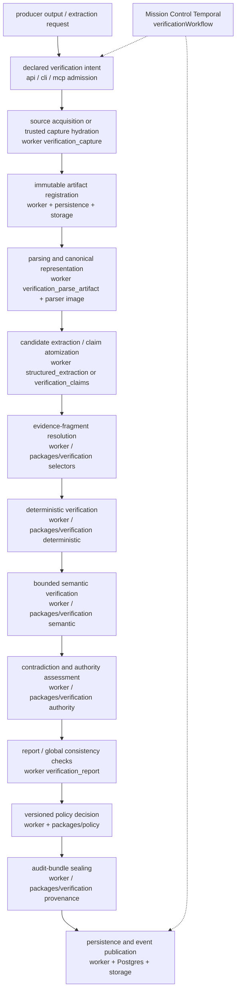

# Verification Module Guide

Knowledge Services owns an independent evidence compiler and policy-controlled verification service (`verification.v1`). It is not a research agent and not a confidence-scoring prompt. Large-language-model judgment is one bounded stage after deterministic checks. Cross-repository callers use HTTP, CLI, or MCP — they must not import `@aiengineer/knowledge-verification`.

This guide describes the **as-built** module. The workspace folder `docs/workspaces/verification-module/` is a historical ledger, not current truth. Source of truth: code plus `docs/workspaces/verification-module/stabilization-20260908/AS-BUILT-INVENTORY.md`.

## What it is

For every candidate result the module evaluates **five ordered questions**. Later stages may add restrictions; they must not reverse an earlier deterministic failure.

1. **Capture integrity** — were the exact source bytes or canonical representation preserved?
2. **Selector integrity** — does the stored locator deterministically select the claimed evidence?
3. **Mechanical correctness** — do identity, type, value, unit, period, normalization, and arithmetic checks pass?
4. **Semantic support** — does the selected evidence support the complete atomic claim?
5. **Policy admission** — does the risk- and use-case-specific policy permit publication, ranking, or downstream use?

Policy admission (question 5) is recorded here as binding artifacts and digests. `packages/policy` is the admission authority.

### Orthogonal properties

These are stored and reported independently. No aggregate score may erase a component.

| Property | Question |
| --- | --- |
| Evidence support | Does this evidence entail the claim? |
| World correctness | Is the claim true under authoritative/corroborated evidence? |
| Attribution faithfulness | Did the cited input influence production of the claim? |
| Source authority | Is this source fit for this kind of claim? |
| Provenance integrity | Can the artifact and execution chain be authenticated and replayed? |

### Verdict lattice and policy outcomes

`SemanticVerdictSchema` values:

`pending_semantic_review`, `directly_supported`, `supported_with_qualification`, `partially_supported`, `context_only`, `contradicted`, `mixed_or_conflicting`, `not_supported`, `insufficient_evidence`, `unverifiable`, `source_unavailable`, `locator_error`, `parser_error`, `derived_verified`, `derived_failed`.

`PolicyOutcomeSchema`: `pass`, `pass_with_warnings`, `review`, `fail`, `abstain`.

Mechanical status: `passed` | `failed` | `review_required`.

Adjudication decision: `affirm` | `reject` | `defer`. Decision provenance: `human_origin` | `synthetic_engineering`.

Keep **execution state** separate from **admission disposition**. Knowledge Services operation state is `queued` | `running` | `needs_review` | `quarantined` | `succeeded` | `failed` | `cancelled`. Mission Control reports `completed` with `review_required` as successful execution with a held result — not an infrastructure failure.

## As-built architecture

```text
packages/verification          algorithms (deterministic, selectors, claims, semantic, provenance, providers)
        ↓
packages/contracts             Zod request/result schemas (verification.v1)
        ↓
packages/application           use-case composition, admission, catalogs
        ↓
apps/api | apps/cli | apps/mcp | apps/worker
```

- Persistence uses the pinned `@aiengineer/database-contract` **0.2.38** (`packages/persistence` vendored tgz). Migrations live in `../ai-engineer-db-contract`. Apps do not own a second schema tree.
- Object storage bucket: `VERIFICATION_STORAGE_BUCKET` (default `ai-engineer-cloud-bucket`). Object key: `{tenantId}/{digest[7:9]}/{digest[7:]}` where digest is the hex after `sha256:`.
- Mission Control / Temporal in `../ai-engineer-mission-control` is the cross-service orchestrator (`verificationWorkflow`, launch `REJECT_DUPLICATE`). KS owns algorithms and durable execution; MC owns dispatch, cancellation, and retry classification.

Parser jobs run in the pinned Docker image at `services/verification-parser`. Docling (`services/docling`) is a separate conversion boundary.

## Operation kinds and use cases

**13 operation kinds** (`verificationServiceOperationKinds`):

`verification_capture`, `verification_extraction`, `verification_replay`, `verification_parse_artifact`, `verification_metric`, `verification_benchmark`, `verification_benchmark_compare`, `verification_structured_extraction`, `verification_claims`, `verification_report`, `verification_adjudication`, `verification_adjudication_decision`, `verification_audit_bundle`.

**12 use cases** (`VerificationUseCaseSchema`):

`captureSource`, `parseArtifact`, `extractStructuredData`, `verifyExtraction`, `verifyClaims`, `verifyReport`, `verifyMetricObservation`, `runBenchmark`, `compareBenchmarkRuns`, `replayRun`, `inspectAuditBundle`, `requestAdjudication`.

`recordAdjudicationDecision` is a public mutation and operation kind; it is **not** a member of `VerificationUseCaseSchema`.

## Logical pipeline

Spec §6.1 stages annotated with the process that executes them:



Offline diagnostics (`knowledge demo diagnostics-companies`) compose the same algorithms in-process without HTTP or provider authority.

## Documentation map

| Document | Role |
| --- | --- |
| [SURFACE-REFERENCE.md](SURFACE-REFERENCE.md) | HTTP routes, CLI catalog, MCP tools, worker activities |
| [OPERATOR-RUNBOOK.md](OPERATOR-RUNBOOK.md) | Local start, env profiles, demo, CLI flows, recovery |
| [DEPLOYMENT.md](DEPLOYMENT.md) | Processes, env matrix, rollout, rollback, smoke |
| [INTEGRATION-GUIDE.md](INTEGRATION-GUIDE.md) | Mission Control, Eve, Cursor Cloud, dashboards |
| [../../packages/verification/README.md](../../packages/verification/README.md) | Algorithm package facade and invariants |
| [../specifications/verification-module.md](../specifications/verification-module.md) | Design vocabulary and intent (not as-built topology) |
| [../workspaces/verification-module/](../workspaces/verification-module/) | Historical workspace ledger |
| [../workspaces/verification-module/ENGINEERING-HANDOFF-20260908.md](../workspaces/verification-module/ENGINEERING-HANDOFF-20260908.md) | Current engineering acceptance state |
| [../workspaces/verification-module/ACCEPTANCE-MATRIX.md](../workspaces/verification-module/ACCEPTANCE-MATRIX.md) | 46-row completion matrix |
| [../workspaces/verification-module/stabilization-20260908/](../workspaces/verification-module/stabilization-20260908/) | As-built inventory and stabilization ledgers |

## Spec deviations / deferred

As-built surfaces vs `docs/specifications/verification-module.md` §17–§19. These are deferred or renamed, not silent omissions.

| Spec | Stated | As-built |
| --- | --- | --- |
| §17 | `POST /v1/verification/reviews` | Absent. Review is `POST /v1/verification/adjudications:request` and `:record-decision`. |
| §19 | `knowledge_extract_structured` | Registered as `knowledge_extract_structured_data`. |
| §19 | `knowledge_get_operation` | Registered as `knowledge_get_verification_operation`. |
| §19 | `knowledge_inspect_run` | Absent. Use `knowledge_get_verification_run` / `knowledge_get_verification_manifest`. |
| §18 | `--work-item-id`, `--attempt-id`, `--idempotency-key`, `--output` on catalog commands | Absent. Those values travel in `--context` JSON (`missionId`, `workItemId`, `attemptId`, `idempotencyKey`). `--output` exists only on local specials (demo, attestation-export, benchmark capture diagnostics-companies). |
| §18 | JSONL / manifest-URI input; checkpoint / resume | Absent. Catalog `--input` is a JSON object. |

## Current acceptance state

**31 proved / 8 partial / 7 missing** (EV-161, 2026-09-08). Engineering-ready for Mission Control integration. Quality promotion is still gated.

Remaining rows and the external input each needs:

| ID | Status | Requirement | External input |
| --- | --- | --- | --- |
| VR-007 | partial | Every accepted extracted leaf has value, derivation, source fragment, and lineage. | Human gold field audit / labels |
| VR-008 | missing | Schema validity, semantic accuracy, and confidence calibration are reported separately. | Human labels + calibration artifacts |
| VR-010 | partial | Report assertions map to qualifier-preserving atomic claims and exact report offsets. | Human claim-decomposition gold set |
| VR-011 | missing | Citation correctness and claim-weighted completeness are independent metrics. | Human labels + ALCE/TREC-style benchmark |
| VR-014 | partial | Ambiguous/critical results support abstention and human review. | Human-origin adjudication (synthetic dashboard proof exists) |
| VR-017 | partial | Interfaze uses ZDR by policy for sensitive inputs and never verifies itself alone. | Interfaze sensitive-input vendor approval (ZDR/DPA/output rights) |
| VR-019 | partial | Datasets, cases, labels, variants, graders, and manifests are immutable/versioned. | Human labels + sealed Pilot |
| VR-020 | missing | Pilot compares baseline, Interfaze, cascades, and consensus/abstention on identical frozen cases. | Sealed paired experiment after labels + source rights |
| VR-021 | missing | Benchmark reports uncertainty, calibration, catastrophic errors, slices, cost, latency, stability, and review burden. | Sealed quality benchmark after labels |
| VR-034 | missing | Every completion claim is independently audited against this matrix. | Final independent release audit |
| VR-037 | partial | `diagnostics-companies-v1` contains immutable, licensed captures from TruDiagnostic, Generation Lab, and publication-layer sources. | Source-license / access decisions |
| VR-038 | missing | Company facts, algorithms, biomarkers, counts, systems, limitations, and publication links extract with exact capture-bound selectors. | Human gold field ledger |
| VR-040 | missing | First-party support, independent corroboration, promotional authority, publication applicability, and world correctness remain distinct. | Human gold claim ledger + policy truth table |
| VR-041 | partial | Swapped names, algorithms, biomarkers, counts, institutions, qualifiers, and citations degrade verdicts monotonically. | Human labels + remaining named-family / provider arms |
| VR-042 | partial | One offline command generates TruDiagnostic, Generation Lab, comparison, and verification-audit reports plus machine ledgers and manifest. | Bind demo to sealed benchmark after human labels |

The review pack `catalog/verification-benchmarks/diagnostics-companies-benchmark-v1-human-review-v3/` has 180 blank candidates. No human label has been invented. Until labels, source-rights decisions, Interfaze sensitive-input approval, and the sealed quality benchmark exist, the offline demo reports `verification_incomplete` / exit 2 by design.
