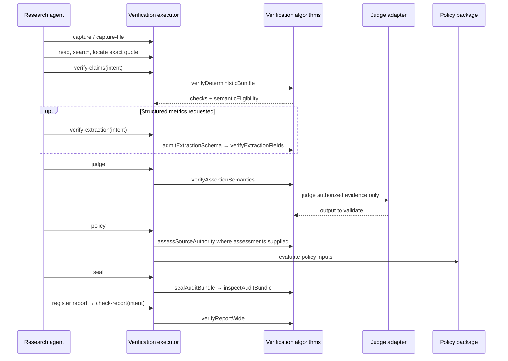

# Understanding verification: interfaces and likely call sequences

Reading snapshot: 2026-09-11. This is a comprehension guide to the current working tree, with proposed improvements alongside it. The [final clean-code implementation plan](CLEAN-CODE-RECOMMENDATION.md) consolidates these recommendations and governs implementation where suggestions differ. No refactor has been implemented by writing these documents. Prototype compatibility and experiment caller migration are outside the walkthrough.

Start with sections 1–3 to follow an agent's work. Sections 4–8 explain the functions behind that work. Section 9 maps the contracts, and the final inventory lets you find every exported declaration in the production algorithm files.

Companion documents: [understanding the tests](TESTING-COMPREHENSION.md) and [clean testing recommendations](CLEAN-TESTING-RECOMMENDATION.md).

**Reading convention:** “Current” describes inspected source. “Likely” describes a useful composition rather than a guaranteed runtime path. “Recommendation” describes a change that has not been made. Source links lead to the owning files; declaration names are search targets within them.

## 1. What the module actually does

Verification asks five questions in order:

1. Do the capture bytes match the recorded artifact?
2. Does the selector identify the claimed evidence within those bytes?
3. Do the mechanical checks pass, including numeric calculations and producer/verifier separation?
4. Does that evidence support the proposition?
5. Does policy permit using the result?

The first three are deterministic. Semantic judges handle question 4. The policy package owns question 5. A later stage cannot erase an earlier deterministic failure.

| Layer | What you give it | What it owns | Source |
| --- | --- | --- | --- |
| Agent skill | A research or verification task | Instructions for choosing tools and interpreting results | [Platform skill](../../skills/knowledge-verification/SKILL.md), [executor skill](../../apps/verification-executor/skills/knowledge-verify/SKILL.md) |
| Agent-facing executor | Intent files, capture IDs, exact quotes | Turns intent into bundles and staged run artifacts | [executor.ts](../../apps/verification-executor/src/executor.ts) |
| Platform CLI/MCP/API | Versioned requests and ownership context | Submits operations and reads their results | [MCP reference](../../skills/knowledge-verification/mcp-reference.md) |
| Application and worker | Authenticated requests, registered artifacts, injected dependencies | Authorization, hydration, execution, persistence and sealing composition | [claims use cases](../application/src/verification-claims.ts), [worker](../../apps/worker/src/) |
| This package | In-memory bundles, bytes, rules and trusted ports | Verification algorithms and provider adapters | [public facade](src/index.ts) |
| Contracts | Untrusted payloads | Zod schemas, shared types, wire and retained artifact shapes | [verification contracts](../contracts/src/verification/index.ts) |

An interface describes the data or capability a function needs. A *port* is an interface supplied by the surrounding application, such as “load an authorized artifact” or “ask a judge.” The core can call the port without owning its database, credentials or deployment.

### The vocabulary you will see everywhere

| Name | Meaning |
| --- | --- |
| Source | The logical document, endpoint or dataset. |
| Capture | One immutable observation of a source, linked to content and possibly projection artifacts. |
| Artifact handle | Identity and digest of registered bytes. Public requests usually carry only `{artifactId, digest}`; the full trusted handle also contains registration metadata. |
| Projection | A canonical representation of a document, such as an HTML tree, PDF text or table grid. |
| Selector | A reproducible locator within a representation. It is not a display excerpt. |
| Fragment / evidence edge | The located evidence and its relationship to an assertion, including support/context/contradiction roles. |
| Assertion | An atomic proposition with qualifiers, risk and evidence. |
| Bundle | Sources, captures, assertions, metrics and provenance declarations to verify together. |
| Mechanical result | Checks and statuses, including whether semantic verification is eligible. |
| Semantic assessment | Evidence support and judge information. It keeps world correctness, authority and attribution separate. |
| Manifest / audit bundle | Retained run description and its integrity bindings. Sealing does not itself grant policy admission. |

**Recommendation:** keep these nouns consistent across function names, types and skill examples. In particular, avoid using “verified” to mean all of schema-valid, mechanically passed, semantically supported and policy-admitted.

## 2. The research agent sequence: `knowledge-verify`

This is the most direct sequence for a research agent to follow. The [executor skill](../../apps/verification-executor/skills/knowledge-verify/SKILL.md) describes it; [executor.ts](../../apps/verification-executor/src/executor.ts) composes the core calls. The agent writes intent files. The executor constructs artifacts, bundles, digests and verdicts.



| Step | Agent action | Core function / important handoff | Continue when |
| --- | --- | --- | --- |
| 1 | Health check; choose one run ID | Executor setup and store | Executor is available. |
| 2 | Discover URLs, then capture them | Capture implementation owns acquisition and retained bytes | Capture contains useful source content. |
| 3 | Read/search captured content, then locate quotes | Selector resolution produces evidence location and digest | Every required quote resolves uniquely. |
| 4 | Write claims intent; `verify-claims` | Executor constructs the bundle and calls `verifyDeterministicBundle` | Mechanical result passes and semantic eligibility is true. |
| 5 | If needed, write extraction intent; `verify-extraction` | `admitExtractionSchema` then `verifyExtractionFields` | Field result is valid. |
| 6 | `judge` | `verifyAssertionSemantics`; internally authorization then judge execution | Required semantic assessments permit continuing. |
| 7 | `policy` | Source authority assessment contributes to policy inputs | Policy outcome is `pass` or `pass_with_warnings`. |
| 8 | `seal` | Build manifest, bind policy inputs, seal and inspect | Inspection succeeds; inspect signature status too. |
| 9 | Write/register report, then `check-report` | `verifyReportWide` with report assertions and existing claim assessments | Executor report result is `ok: true`. |
| 10 | Read status and write summary | Run receipts and retained artifact references | Summary accurately reports limitations and dropped claims. |

The executor report check happens **after the claims run is sealed**. It creates a separate report-check artifact; it is not the same procedure as the platform `verifyReport` operation below. Its source constructs report citation assessments from the existing claim chain and uses the first evidence edge for each cited claim.

**Recommendation:** document that distinction directly beside both report entry points. Also review whether selecting only the first evidence edge gives the report check enough information for claims whose support depends on several fragments. That is a behavior question, not a formatting refactor.

For actual intent fields, use the executor's [intent reference](../../apps/verification-executor/skills/knowledge-verify/references/intents.md). Do not substitute platform request bodies for these files.

## 3. The platform agent sequence: `knowledge` CLI or MCP

This surface submits queued operations against registered artifacts. It uses the platform store and ownership context. The executor has a separate store and receipt model; the two surfaces should not be mixed within a run.

### The common lifecycle

```text
Submit {context, request}
  → AcceptedOperation: operationId + status/read-control URLs
  → poll getVerificationOperation(operationId)
  → inspect terminal operation state
  → read the operation family's authoritative result
  → inspect quality/policy disposition
  → use returned registered handles in the next operation
```

An accepted operation is not a completed verification and does not contain the output artifact handles. Even `state: succeeded` means execution completed; quality can still fail or require review. A compact CLI `--wait` result is not the authoritative signed terminal resource.

MCP mutation context carries tenant, correlation and idempotency fields plus ownership hints where required. It differs from the CLI's full `OperationContext`. The authenticated application binds identity; the agent does not choose a trusted runtime principal by putting one in JSON. See [examples and context](../../skills/knowledge-verification/examples.md).

### Which operation comes next?

All request names below are contracts, primarily in [requests.ts](../contracts/src/verification/requests.ts). Common field: `verificationContractVersion: "verification.v1"`.

| Agent intention | Request and principal fields | MCP mutation | Next read / next action |
| --- | --- | --- | --- |
| Capture a source | `CaptureSourceRequest`: acquire URL or register content; requested projection kinds | `knowledge_capture_source` | Poll; HTTP `GET /v1/verification/captures/:operationId`. No platform capture-show MCP tool in the inspected skill. |
| Parse an artifact | `ParseArtifactRequest` from [parse.ts](../contracts/src/verification/parse.ts) | `knowledge_parse_artifact` | Poll and follow parse result/receipt contract. |
| Produce structured data | `ExtractStructuredDataRequest`: capture ID, representation handle, schema handle, `registered_default` profile | `knowledge_extract_structured_data` | `knowledge_get_structured_extraction`. |
| Check an existing extraction | `VerifyExtractionRequest`: capture IDs, schema handle, output handle | `knowledge_verify_extraction` | Poll and inspect receipt; no dedicated verification-extraction result MCP read in the skill. |
| Verify claims/citations | `VerifyClaimsRequest`: capture IDs, assertions artifact | `knowledge_verify_claims` | `knowledge_get_verification_claims_result`. |
| Verify a report | `VerifyReportRequest`: report handle, claim-ledger handle, capture IDs | `knowledge_verify_report` | `knowledge_get_verification_report_result`. |
| Verify metric observations | `VerifyMetricObservationRequest`: capture IDs, observations artifact | `knowledge_verify_metric` | Poll; inspect operation receipt and run/manifest. |
| Inspect an audit bundle | `InspectAuditBundleRequest`: audit-bundle handle | `knowledge_inspect_audit_bundle` | `knowledge_get_audit_inspection`. |
| Recompute a prior run | `ReplayRunRequest`: run ID, replay mode | `knowledge_replay_run` | Read verification run and manifest. |
| Request human review | `RequestAdjudicationRequest`: target, reason, evidence packet, optional note | `knowledge_request_adjudication` | `knowledge_get_adjudication`. |
| Record human decision | `VerificationAdjudicationDecisionRequest`: subject, packet, decision, rationale | `knowledge_record_adjudication_decision` | `knowledge_get_adjudication_decision`; restricted reviewer identity, not a model agent. |
| Resolve an uncertain provider attempt | Reconciliation operation ID, attempt ID, artifact | `knowledge_apply_provider_reconciliation` | `knowledge_get_provider_reconciliation`; use retained observation, not an invented response. |
| Run/compare offline benchmark | `RunBenchmarkRequest` / `CompareBenchmarkRunsRequest` | `knowledge_run_benchmark` / `knowledge_compare_benchmark_runs` | Benchmark run, manifest or comparison reads. Algorithm orchestration is in evaluation/application, outside this walkthrough. |

General inspection reads are `knowledge_get_verification_run`, `knowledge_get_verification_manifest`, `knowledge_list_verification_cases`, `knowledge_get_verification_case` and `knowledge_get_verification_evidence`. Their IDs refer to different entities: operation ID, run ID, case-run ID and evidence ID are not interchangeable.

**Current admission limits:** the skill documents exactly one capture for verification of an existing extraction, although the shared request schema accepts a larger capture list. Capture acquisition/registration also admits fewer combinations than its Zod schema expresses: web pages require `html_dom`; the PDF acquire path permits `pdf_text` plus `geometry`. Schema acceptance alone is insufficient to establish runtime capability.

**Likely claims/report sequence:** obtain registered captures → prepare/register assertions or report ledger through the surrounding workflow → submit verification → poll → terminal read → consume admitted result or request adjudication. Registration is an outer capability, not a function in this package or a license to fabricate handles.

Held outcomes (`held_for_review`, `needs_review`, `review_required`) stay held. Adjudication records a packet-bound decision; its `admissionChanged` is always false. It does not rewrite deterministic findings.

**Recommendation:** expose a per-operation lifecycle guide next to each request, with its terminal reader and admitted capabilities. Keep schema shape and runtime admission as explicitly separate checks. This will remove much of the guesswork currently distributed across contracts and skills.

## 4. The deterministic path: from bytes to mechanically checked evidence

Entry point: [verifyDeterministicBundle](src/deterministic/engine.ts).

| Interface | What the caller supplies / receives |
| --- | --- |
| `DeterministicVerificationInput` | `bundle`, hydrated `artifacts`, trusted `runtimePrincipals`. |
| `HydratedVerificationArtifact` | Artifact ID plus actual string or byte content. The engine does not fetch it. |
| `RuntimePrincipalBinding` | Producer/verifier deployment IDs and principal digests supplied by trusted composition. |
| `DeterministicVerificationOptions` | Optional admitted selector resolvers and a projection-lineage admission callback. |
| `DeterministicVerificationResult` | Overall status, per-assertion/per-metric evidence and checks, semantic eligibility, failed codes and review reasons. Owned by contracts. |

Current sequence inside the function:

1. Parse `VerificationBundleSchema`; index artifacts, sources and captures; detect duplicate IDs.
2. Hash capture bytes and check byte lengths. Verify projection bytes and required lineage admission.
3. Compare declared and runtime producer/verifier identities; establish independent deployments/principals.
4. For each assertion, verify its evidence edges. Resolve selectors and compare their bound definitions and selected content digests.
5. Index metric observations, detect calculation cycles, recursively resolve dependencies and replay exact decimal calculations.
6. Combine checks into the returned contract. Only a passing result can be eligible for semantic verification.

The caller must distinguish “function returned a failed result” from “input parsing threw.” The former is a verification finding; the latter is an invalid invocation or an integrity/precondition problem.

### Selector interfaces

[deterministic/selectors.ts](src/deterministic/selectors.ts) owns `SelectorResolutionRequest`, `TrustedSelectorResolution`, `DeterministicSelectorResolver` and `DeterministicSelection`.

```text
SelectorResolutionRequest
  captureId + representationArtifactId + representationDigest + selector + content
    → resolveWithAdmittedResolver(request, resolvers)
      → built-in text/JSON handling or an admitted resolver
        → resolution + selectedContent (+ optional selectedText/selectedValue)
```

`resolveBuiltInSelector` handles built-in locator kinds; `undefined` means it cannot handle that kind, not that evidence was verified. Inspect the returned resolution status as well as whether a value exists.

`ProjectionSelectorResolver` / `projectionSelectorResolver` handle canonical structured projections. [projections.ts](src/selectors/projections.ts) defines `CanonicalProjection` and its HTML, PDF-text, geometry, table, transcript, repository, dataset and paginated-API variants. `parseCanonicalProjection(bytes)` admits those bytes; it does not fetch or convert a source document.

**Recommendation:** split the engine into named stages matching the six steps above. Keep the checks and their ordering visible. Use a name such as `buildDeterministicResult` for final aggregation: this stage does not cryptographically seal anything.

### Numeric and hash primitives

| Functions | When called | Meaning |
| --- | --- | --- |
| `canonicalizeJson`, `digestCanonicalJson` | When comparing/sealing structured values | RFC 8785 canonical representation and its SHA-256 digest. |
| `sha256Digest` | When binding actual bytes or UTF-8 text | Hashes the supplied content directly. |
| `parseDecimal`, `replayDecimalOperation` | Numeric evidence and calculation checks | Exact fractions with bigint numerator/denominator; identity, sum, difference, product, ratio, percent change. |
| `compareFractions`, `withinTolerance`, `formatRoundedDecimal` | Comparing and presenting replayed values | Explicit comparison, tolerance and rounding. |

Do not replace canonical hashing with ordinary JSON serialization or exact decimal replay with floating-point arithmetic during a readability refactor.

## 5. Extraction: schema-valid is only the beginning

There are two workflows: produce a candidate through a provider, or check an already-produced candidate. Both eventually need deterministic evidence verification. A provider's valid JSON response is not proof that its fields came from the source.

### Interfaces in call order

| Function / owning interface | Input → output | What it establishes |
| --- | --- | --- |
| `admitExtractionSchema` / `ExtractionSchemaAdmissionLimits` | Schema ID/version, raw schema, optional tighter limits → `ExtractionSchemaAdmission` | Schema belongs to the bounded supported subset. Check `admitted` and `schema`. |
| `AdmittedExtractionSchema` | Canonical schema snapshot, digest, gate version, limits | In-process admitted schema, associated with compiled nodes in a WeakMap. |
| `validateExtractionCandidate` | Admitted schema + unknown candidate → `CandidateValidationResult` | Candidate shape/type checks and leaf paths. No source support claim. |
| `verifyExtractionFields` | `ExtractionFieldVerificationInput` → `ExtractionFieldVerificationResult` | Candidate validation plus field evidence, duplicate rules and total rules. |
| `verifyExtractionFieldsWithEvidence` | Same input → `ExtractionFieldEvidenceResult` | Same underlying verification pass plus immutable accepted leaf evidence. |

The evidence variant calls the internal `verifyExtractionFieldsWithAcceptedSelections`; it does not require the caller to call `verifyExtractionFields` first. Those are alternative public entry points. The internal selection function is exported by its source file but deliberately omitted from the extraction facade.

`ExtractionFieldVerificationInput` contains:

- `schema` and `candidate`: the admitted schema and proposed object.
- `fields`: `ExtractionFieldRule[]`, one rule per path, specifying comparison and optional normalization/format/source-component settings.
- `evidence`: `ExtractionEvidence[]`, binding each path to a capture, representation, selector and optional expected selection digest.
- `representations`: `ImmutableExtractionRepresentation[]`, the bytes against which evidence will be checked.
- Optional `normalizations`, `duplicates`, `totals` and `selectorResolvers`.

Comparison kinds are exact, normalized text, decimal, percentage, currency, unit, date, datetime, enum, identifier and checksum. `sourceComponent` explicitly extracts values from table cells, geometry tokens or transcripts; location metadata is not the value. `DuplicateRecordRule` supplies key paths; `CrossFieldTotalRule` supplies operands, operation and tolerance.

`AcceptedExtractionLeaf` contains the candidate value, raw source value, derivation, source locator, selected digest and fragment ID. Optional computation metadata describes deterministic replay; it does not claim that the source generated a calculated value. On failed verification the evidence variant returns no accepted leaves. The application's [verification-admission.ts](../application/src/verification-admission.ts) adds registered parser lineage before persistence; core leaf evidence alone is not a registered publication.

### A concrete local sequence

This example demonstrates the algorithm API, not platform registration or an admitted production run. The schema object returned by admission must be used in the same process.

Validated against the current source: the example returns `valid: true` and one accepted leaf with value `Acme`. Each schema node requires a non-empty description; even a structurally ordinary JSON schema is rejected without those descriptions.

```ts
import {
  admitExtractionSchema,
  canonicalizeJson,
  sha256Digest,
  verifyExtractionFieldsWithEvidence,
} from "@aiengineer/knowledge-verification";

const admission = admitExtractionSchema({
  schemaId: "vendor-name",
  schemaVersion: "1",
  schema: {
    type: "object",
    description: "One vendor name selected from captured evidence.",
    additionalProperties: false,
    required: ["vendor"],
    properties: { vendor: { type: "string", description: "The exact vendor name.", maxLength: 100 } },
  },
});
if (!admission.admitted || !admission.schema) {
  throw new Error("Example schema was not admitted");
}

const content = new TextEncoder().encode(canonicalizeJson({ vendor: "Acme" }));
const artifactId = "22222222-2222-4222-8222-222222222222";
const digest = sha256Digest(content);

const evidenceResult = verifyExtractionFieldsWithEvidence({
  schema: admission.schema,
  candidate: { vendor: "Acme" },
  fields: [{ path: "/vendor", comparison: "exact" }],
  evidence: [{
    path: "/vendor",
    captureId: "capture-example",
    representationArtifactId: artifactId,
    representationDigest: digest,
    selector: { kind: "json_pointer", pointer: "/vendor" },
  }],
  representations: [{ captureId: "capture-example", artifactId, digest, content }],
});
// Inspect valid, candidateValid, checks and acceptedLeaves.
```

**Recommendation:** make schema admission a discriminated result with `admitted: true` always carrying `schema`. Document its process-local binding rather than making callers infer it from the WeakMap. Keep compiled nodes private unless a concrete use case requires exposing them. Split field verification into admission, indexing, selection, comparison and aggregate-rule steps; use an exhaustive comparison table or switch.

## 6. Claims, reports, authority and semantic judgment

### Claim decomposition is an optional preparation step

`acceptClaimDecomposition(report, proposal)` validates a `ClaimDecompositionProposal`: report digest, UTF-16 offsets, exact contiguous segments covering the whole report, classifications, atomic declarations and preserved qualifiers. It returns `AcceptedClaimDecomposition`.

It **does not call a model**, create evidence, or prove that the model found every factual claim correctly. `evaluateDecompositionProposal(accepted, annotation)` measures exact-range precision/recall only against a human-adjudicated `DecompositionAnnotationCase`; synthetic annotations yield `pending_human_gold`.

Current platform `verifyReport` consumes an already prepared ledger; it does not automatically call decomposition acceptance. Use decomposition → ledger construction as a likely preparation sequence, not as a claim about that route's implementation.

### Current platform report call order

Confirmed in [verification-claims.ts](../application/src/verification-claims.ts):

```text
verifyReport(request, context)
  → authorize + hydrate report and ledger, paired per artifact
  → parse ledger; bind report handle and capture set
  → hydrate and verify capture registrations and projection lineage
  → bind runtime principals
  → verifyDeterministicBundle
  → verifyReportWideFromLedger(reportText, ledger, baseResult)
  → applyReportWideMechanicalGates(baseResult, reportSummary)
  → retain preparation for later semantic execution
```

`ReportAssertionAssessment` contains report text/ranges, weight/severity, citation requirements, citation assessments and consistency/qualifier metadata. `ReportCitationAssessment` contains pointer status, semantic verdict and source-family information. `ReportVerificationSummary` computes completeness, citation correctness, pointer failures, duplicates, contradictions, qualifier omissions, consistency mismatches and source counts.

`verifyReportWideFromLedger` deliberately supplies `insufficient_evidence` semantic verdicts and unknown source-family/independence values. Its summary is a mechanical preparation, not completed semantic scoring. `applyReportWideMechanicalGates` adds hard failure codes and review reasons; new hard failures close semantic eligibility. Adding a review reason alone does not change the overall status to `review_required`.

Coverage is explicitly `producer_declared_assertions_only`. A complete score for the supplied ledger does not establish that every factual sentence in the report was declared.

**Recommendation:** name or type the mechanically prepared report summary distinctly from a summary built with actual semantic assessments. Address the non-null assertion on a ledger evidence lookup with a documented input contract or explicit validation. Returning “missing” instead of throwing would change behavior and should be reviewed and tested as such.

### Semantic interfaces and sequence

```text
verifyAssertionSemantics({ bundle, deterministicResult, assertionId,
                           selectedFragments, adapters, execution })
  → mechanicalSemanticClosure
      closed: return locator_error/unverifiable assessment; no judge call
      open: authorizeSemanticCase
              → verifySemanticCase
                → snapshot primary and optional cross-family adapter
                → judge primary, validate returned output
                → where required, judge independent second family
                → reconcile assessments and return SemanticAssessmentRecord
```

| Interface | Meaning / responsibility |
| --- | --- |
| `MechanicallySelectedFragment` | Evidence/fragment IDs, exact text and selected digest matching the mechanical result. Caller supplies the bytes-derived text. |
| `AuthorizedSemanticFragment` | Selected fragment plus declared role/origin. |
| `AuthorizedSemanticCase` | Assertion, qualifiers, entity bindings, risk and authorized fragments. Branded and recorded in a runtime WeakSet. Construct through `authorizeSemanticCase`; JSON deserialization cannot recreate its authorization. |
| `SemanticJudgeAdapter` / alias `SemanticJudgePort` | Trusted identity, input capacity, empty tool catalog and asynchronous `judge(input, execution)`. Raw output is unknown until validated. |
| `SemanticJudgeExecution` | Optional abort signal and deadline. |
| `SemanticAssessmentRecord` | Reconciled verdict/disposition, fragment references, identities, reasons and separate judgment dimensions. |

`authorizeSemanticCase` checks both bundle-wide and assertion-specific mechanical eligibility, atomic proposition, fragment count/size, declarations and content hashes. `verifySemanticCase` sends a blinded evidence-only input: fragment IDs and exact text, not the evidence edge's suggested support role.

A second family is required for high/critical risk or certain uncertain primary verdicts. Family **and** deployment must differ. Missing required independent judgment gives review, or abstention for critical risk. Disagreement yields review. Semantic `disposition: admit` remains distinct from final policy admission.

**Recommendation:** keep `verifyAssertionSemantics` as the readable orchestration entry point, with authorization/execution separately available for staged workflows. `authorizeSemanticCase` currently has four parameters; a named input object would make its trust dependencies easier to read. Name output-validation guards after verdict rules without changing the verdict lattice.

### Authority, rescue and diagnostics are separate branches

| Function | Input → output | What it does not do |
| --- | --- | --- |
| `assessSourceAuthority` | Assertion ID + `VerificationSourceAssessment[]` → `AuthorityDecision` | Does not research sources or decide full policy. Checks fitness, independence and scope using supplied assessments. |
| `proposeUncitedEvidenceRescue` | Query + `RescueBudget` + `BoundedEvidenceRescuePort` → candidates pending mechanical admission | Does not turn search snippets into accepted evidence. Current implementation makes one search call, even though the budget permits up to three. |
| `summarizeAttributionPerturbations` | `AttributionPerturbationObservation[]` → perturbation metrics | Does not establish attribution through an ordinary evidence-support judgment. |
| `observeSemanticModelDrift` | Requested/returned model and deployment → `SemanticDriftObservation` | Does not schedule monitoring. Missing returned model does not count as a mismatch. |
| `semanticCalibrationStatus` | No input → pending empirical labels, no calibrated probability | Does not convert provider confidence into calibrated correctness. |

Likely rescue path: propose candidates → capture/register through the outer application → resolve evidence and verify mechanically → authorize a new semantic case. The judge itself gets no rescue/search tools.

Current `AuthorityDecision.independentCorroboration` means at least one qualifying independent source family, not necessarily two independent sources. **Recommendation:** clarify that name or describe the threshold at its declaration before anyone reads it as a quorum requirement.

## 7. Provider adapters: where side effects begin

Most core operations compute from supplied data. Provider adapters may perform network requests through injected `fetch` and persist observations through `ProviderArtifactSink`.

| Interface / implementation | Role |
| --- | --- |
| `ProviderRegistration`, `ProviderModalityRegistration`, `ProviderPromotionState` | Registry capabilities, limits, configuration digest and promotion state. `registeredProvider(id)` finds a record; registration alone is not runtime admission. |
| `ProviderArtifactSink.assertExternalProcessingAdmission` | Verify the requested provider/modality may receive this data. |
| `ProviderArtifactSink.persistBeforeDispatch` | Retain request bytes and digest before network dispatch. |
| `ProviderArtifactSink.persistAfterResponse` | Retain observed response bytes, optional precontext and HTTP status. |
| `GatewaySemanticJudgeAdapter` | Evidence-only Gateway judge implementation. |
| `GatewayStructuredExtractionProvider` | Produce a candidate against an admitted output schema. |
| `InterfazeStructuredExtractionProvider` | `extract` and `runTask` paths, with retained call/precontext information. |
| `RecordedSemanticJudgeAdapter` | Retrieve an output keyed by the authorized input digest; no network/filesystem calls. |
| `ThreeWayNliSemanticJudgeAdapter`, `NliClassifier` | Wrap an injected separately deployed NLI classifier under the judge contract. |
| `ProviderFailure` | Code plus retryability metadata. Retry policy remains an outer orchestration decision. |

Read [gateway.ts](src/providers/gateway.ts), [interfaze.ts](src/providers/interfaze.ts), [bounds.ts](src/providers/bounds.ts) and [semantic-judge.ts](src/providers/semantic-judge.ts) for exact constructor/method shapes.

Typical successful provider path: admit request/schema and execution limits → authorize external processing → persist request → dispatch → retain bounded observed response → parse/validate output → expose the interpreted result. A timeout or interrupted call can leave an uncertain external outcome; retained provider observations and reconciliation contracts exist to represent that separately from a quality verdict.

The Gateway also exposes `prepareGatewaySemanticRequest` and `interpretCapturedGatewaySemanticResponse` for separating preparation from interpretation of retained response bytes. Its prompt/output-schema/configuration digest exports bind the judge configuration. `GatewaySemanticResponseObservation` and Interfaze call/result types describe those observations, not policy admission.

**Recommendation:** make this side-effect sequence explicit in each adapter. Preserve persistence-before-dispatch ordering when extracting functions. The broad provider bounds exports are currently part of the package facade; decide which are intended extension APIs and which belong in private capability files.

## 8. Sealing, inspection and replay

Sealing answers “what exact inputs, results and policy decision did this run bind?” Replay answers “can we reproduce those results from the retained inputs?” These are different operations.

### Seal and inspect

```text
Outer application builds manifest and records policy inputs/decision
  → verificationManifestDigest(manifest)
  → sealAuditBundle({ tenantId, verificationBundle, manifest, policyBinding,
                      recordedPolicyInputsBytes, policyDecision, signer? })
  → inspectAuditBundle(auditBundle, signatureVerifier?)
  → optionally createVerificationDsseSlsaAttestation(...)
```

`sealAuditBundle` validates bundle/manifest schemas, policy versions, artifact inclusion, manifest digest, recorded policy inputs, tenant binding and lineage. It hashes the signable payload and optionally signs it. `verificationManifestSignablePayload` and `auditBundleSignablePayload` define the values hashed without their detached authentication fields.

| Interface | Important fields / methods |
| --- | --- |
| `VerificationPolicyBinding` | Policy version, policy artifact, recorded policy-input artifact. |
| `VerificationAuditBundle` | Bundle, manifest, tenant, policy binding, result/decision digests and detached seal. |
| `DetachedAuditSeal` | Payload digest and optional Ed25519 key/signature fields. |
| `AuditBundleSigner` | Algorithm/key ID and async `sign(bytes)`. `createEd25519Signer` constructs one. |
| `AuditBundleSignatureVerifier` | Async `verify({keyId, payload, signatureBase64})`. `createEd25519Verifier` constructs one from trusted public keys. |
| `AuditBundleInspection` | `valid`, digests, errors and `signatureStatus`: unsigned/verified/unverified/invalid. |

Do not read `valid: true` as “trusted signature verified” without inspecting `signatureStatus`. Optional signatures are part of the current core contract; stricter publication boundaries can require them.

DSSE/SLSA operations require a verified signed audit bundle and trusted builder/key binding. Their types (`VerificationDsseEnvelope`, statement, signature, trusted binding, attestation and inspection) live in [attestation.ts](src/provenance/attestation.ts). `verificationDssePae` computes the authenticated byte framing. Benchmark publication seal/verify pairs are parallel integrity helpers, not benchmark runners.

### Replay ports and exact current order

`replayAuditBundle` in [replay.ts](src/provenance/replay.ts) takes the audit bundle plus trusted artifact, runtime identity, policy and optional semantic/selector/signature dependencies.

1. `inspectAuditBundle`; reject invalid bundle.
2. For each needed artifact, `TrustedArtifactResolver.authorizeArtifact` then `hydrateRegisteredArtifact`; validate registration and bytes. Also hydrate policy and recorded policy inputs.
3. `verifyDeterministicBundle` with trusted runtime principals and admitted projection resolvers.
4. Recompute retained report gates if applicable; compare deterministic result digests.
5. `validateRecordedPolicyInputsArtifact` binds inputs to run, bundle, policy and mechanical results.
6. If recorded assessments require semantic reconstruction, call `VerificationSemanticReplayPort.replay`; compare reconstructed assessments and artifact bindings.
7. `VerificationPolicyReplayPort.replay`; compare policy outcome and decision digest.
8. Return `VerificationReplayResult`, including inspection, recomputed results and replayed artifact IDs.

`AuthorizedArtifactHydration` is the resolver's registration-plus-bytes return value. `VerificationPolicyReplayPort` receives retained policy bytes/inputs and the recomputed deterministic result. `VerificationSemanticReplayPort` receives the audit, policy inputs and verified representation bytes. These capabilities are supplied by the outer application; replay does not discover new evidence.

The public replay request's `replayMode` is not a parameter on this core function. The orchestration layer maps the request to retained artifacts and ports. In the core, judged recorded inputs can require semantic replay; “deterministic only” must not be interpreted as permission to omit a required integrity check.

**Recommendation:** keep authorization/hydration paired. Share genuinely identical binding checks between seal and inspect, but retain the differing failure/reporting semantics. Prefer `build`, `validate`, `sign`, `inspect` and `replay` names for their distinct responsibilities.

## 9. Where the contracts fit

Contracts supply runtime validation as well as TypeScript types. A type annotation alone does not validate received JSON. A Zod parse also does not authorize tenancy, admit a provider, or establish source trust.

| Contract files under `packages/contracts/src/verification` | What to read them for |
| --- | --- |
| [primitives.ts](../contracts/src/verification/primitives.ts), [index-primitives.ts](../contracts/src/verification/index-primitives.ts) | Version, IDs, checks, handles and shared primitive imports. |
| [model.ts](../contracts/src/verification/model.ts) | Sources/captures, evidence, assertions, metric observations, bundle, mechanical result and judgment vocabulary. |
| [selectors.ts](../contracts/src/verification/selectors.ts) | Locator union and resolved-selector contract. |
| [requests.ts](../contracts/src/verification/requests.ts) | Public platform request bodies, context hints, mutation union and common read IDs. |
| [operations.ts](../contracts/src/verification/operations.ts) | Internal command/input envelopes, receipts, events, manifest and result envelope. `VerifyClaimsInput` is not `VerifyClaimsRequest`. |
| [claims.ts](../contracts/src/verification/claims.ts) | Registered claims artifact, report ledger and report gate artifacts. |
| [semantic-policy.ts](../contracts/src/verification/semantic-policy.ts) | Judge output/identity, semantic assessment, source assessment, policy definition, recorded policy inputs, decision and override records. |
| [reads.ts](../contracts/src/verification/reads.ts), [claims-report-reads.ts](../contracts/src/verification/claims-report-reads.ts) | Run/case/evidence resources and signed claims/report terminal resources. |
| [capture-reads.ts](../contracts/src/verification/capture-reads.ts), [parse.ts](../contracts/src/verification/parse.ts) | Capture terminal and parse request/result. |
| [extraction-field-evidence.ts](../contracts/src/verification/extraction-field-evidence.ts) | Registered field evidence, richer than the core's local accepted leaves. |
| [structured-extraction-result.ts](../contracts/src/verification/structured-extraction-result.ts), [structured-extraction-publication.ts](../contracts/src/verification/structured-extraction-publication.ts), [structured-extraction-reads.ts](../contracts/src/verification/structured-extraction-reads.ts) | Successful extraction execution/publication and terminal read shapes. |
| [structured-extraction-failure.ts](../contracts/src/verification/structured-extraction-failure.ts), [structured-extraction-failure-result.ts](../contracts/src/verification/structured-extraction-failure-result.ts) | Failure lifecycle and retained failure result. |
| [provider-reconciliation.ts](../contracts/src/verification/provider-reconciliation.ts), [semantic-observation.ts](../contracts/src/verification/semantic-observation.ts), [semantic-provider-reconciliation.ts](../contracts/src/verification/semantic-provider-reconciliation.ts) | External-call uncertainty, observed responses and reconciliation bindings. |
| [audit-inspection.ts](../contracts/src/verification/audit-inspection.ts) | Audit inspection operation/resource shapes. |
| [adjudication.ts](../contracts/src/verification/adjudication.ts), [adjudication-reads.ts](../contracts/src/verification/adjudication-reads.ts) | Review subjects, decisions and terminal resources. |
| [eve-runtime-attestation.ts](../contracts/src/verification/eve-runtime-attestation.ts) | Retained runtime attestation boundary. |
| `benchmark*.ts` | Benchmark input/comparison/publication/read families; locate through the [contract facade](../contracts/src/verification/index.ts). Caller migration and experiment mechanics are deferred. |

Also read [identity.ts](../contracts/src/identity.ts) for operation context and [integration.ts](../contracts/src/integration.ts) for accepted operations/status. Other contracts in the package belong to retrieval, acquisition, publication, vector stores and related services; they are not verification interfaces merely because they share the package.

The verification facade re-exports selected contract schemas/types. Their owner is still contracts. Generated OpenAPI/JSON-schema files are derived distribution artifacts; edit source schemas and regenerate when a future contract change is approved.

## 10. Recommended clean-code work, in comprehension order

The [final implementation plan](CLEAN-CODE-RECOMMENDATION.md) replaces the earlier recommendation. It permits intentional local API improvements, requires necessary production caller updates, and defers prototype/experiment caller migration. It preserves historical bytes, checks and verdicts during cleanup and identifies product behavior changes to defer. The table below explains the motivation; the final plan supplies the implementation decisions and order.

| Priority | Recommendation | Why it helps you follow the module | Change category |
| --- | --- | --- | --- |
| 1 | Make the facade an explicit public API list; distinguish use-case functions, ports and low-level helpers. | You can see the supported entry points without tracing every wildcard export. | API design; caller updates may follow. |
| 2 | Refactor deterministic and extraction orchestration into named sequential steps. | Code reads in the same order as this guide. | Readability if checks/results remain identical. |
| 3 | Distinguish schema admission, evidence acceptance, semantic disposition and policy admission in names/types. | Stops misleading “success” interpretations. | API/type design. |
| 4 | Keep operation-owned interfaces beside their functions; shared provenance ports together. | Opening a function reveals the input/output vocabulary. | Organization. |
| 5 | Consolidate only helpers with genuinely identical meaning into named internal capability files. | One place for shared JSON-pointer walking or freezing, without a generic utilities drawer. | Readability; prove byte/error parity. |
| 6 | Make hidden runtime admission bindings explicit in API documentation and result types. | Explains why reconstructing an admitted schema or semantic case from JSON fails. | Documentation first; implementation design later. |
| 7 | Split provider dispatch and semantic validation into named stages. | Makes side effects, retention and evidence-only judgment reviewable. | Preserve sequencing and verdict rules. |
| 8 | Resolve report coverage, missing-edge and multi-evidence questions separately. | Prevents silently changing what report verification means during cleanup. | Behavior change requiring focused tests. |

The clean-general, clean-functions and clean-names skills motivate single-purpose operations, intentional public names, bounded input objects and visible side effects. Apply them with judgment: an exhaustive TypeScript union/switch is often clearer than a class hierarchy, and a short helper does not need extraction just to meet a line-count target.

For future implementation, preserve or deliberately version canonical bytes, exact arithmetic, deterministic failure monotonicity, authorization-before-hydration, persistence-before-dispatch and retained replay bindings. Move existing claims/authority cases into discoverable colocated tests where useful; add tests for changed behavior rather than tests that merely mirror a newly extracted helper.

This guide is documentation only. Existing implementation edits in the working tree were not part of this change.

## 11. Complete production declaration index

This index lists exported declarations in the production algorithm source files, including interfaces, type aliases, classes, functions and constants. It excludes tests, fixtures and prototype compatibility files. Source-file exports are not automatically public: extraction intentionally omits its accepted-selection internals. Use the owning submodule index and root facade to confirm importability. Full fields and signatures remain beside the implementation to avoid a second, drifting copy.

| Source | Exported declarations |
| --- | --- |
| [src/authority/assessment.ts](src/authority/assessment.ts) | `AuthorityDecision`, `assessSourceAuthority` |
| [src/claims/decomposition.ts](src/claims/decomposition.ts) | `claimClassifications`, `ClaimClassification`, `DecompositionSegmentProposal`, `ClaimDecompositionProposal`, `AcceptedClaimDecomposition`, `acceptClaimDecomposition`, `DecompositionAnnotationCase`, `evaluateDecompositionProposal` |
| [src/claims/report.ts](src/claims/report.ts) | `ReportCitationAssessment`, `ReportAssertionAssessment`, `ReportVerificationSummary`, `applyReportWideMechanicalGates`, `verifyReportWideFromLedger`, `verifyReportWide` |
| [src/deterministic/canonical.ts](src/deterministic/canonical.ts) | `canonicalizeJson`, `sha256Digest`, `digestCanonicalJson`, `fromPrototypeSha256`, `toPrototypeSha256` |
| [src/deterministic/decimal.ts](src/deterministic/decimal.ts) | `DecimalFraction`, `parseDecimal`, `replayDecimalOperation`, `compareFractions`, `withinTolerance`, `formatRoundedDecimal` |
| [src/deterministic/engine.ts](src/deterministic/engine.ts) | `HydratedVerificationArtifact`, `RuntimePrincipalBinding`, `DeterministicVerificationInput`, `DeterministicVerificationOptions`, `verifyDeterministicBundle` |
| [src/deterministic/selectors.ts](src/deterministic/selectors.ts) | `SelectorResolutionRequest`, `TrustedSelectorResolution`, `DeterministicSelectorResolver`, `resolveBuiltInSelector`, `resolveWithAdmittedResolver`, `DeterministicSelection` |
| [src/extraction/evidence.ts](src/extraction/evidence.ts) | `ExtractionEvidenceJsonScalar`, `ExtractionNormalizationOperation`, `ExtractionLeafDerivation`, `AcceptedExtractionLeaf`, `ExtractionFieldEvidenceResult`, `verifyExtractionFieldsWithEvidence` |
| [src/extraction/schema.ts](src/extraction/schema.ts) | `EXTRACTION_SCHEMA_GATE_VERSION`, `ExtractionSchemaAdmissionLimits`, `DEFAULT_EXTRACTION_SCHEMA_LIMITS`, `AdmittedExtractionSchema`, `ExtractionSchemaAdmission`, `ExtractionSchemaCheck`, `admitExtractionSchema`, `CandidateValidationCheck`, `CandidateValidationResult`, `validateExtractionCandidate` |
| [src/extraction/source-component.ts](src/extraction/source-component.ts) | `sourceComponentValue` |
| [src/extraction/verification.ts](src/extraction/verification.ts) | `FieldComparison`, `ExtractionNormalizationRule`, `ExtractionFieldRule`, `ExtractionEvidence`, `ImmutableExtractionRepresentation`, `DuplicateRecordRule`, `CrossFieldTotalRule`, `ExtractionVerificationCheck`, `ExtractionFieldVerificationResult`, `VerifiedExtractionScalarSelection`, `ExtractionFieldVerificationInput`, `verifyExtractionFields`, `verifyExtractionFieldsWithAcceptedSelections` |
| [src/provenance/attestation.ts](src/provenance/attestation.ts) | `VERIFICATION_DSSE_PAYLOAD_TYPE`, `IN_TOTO_STATEMENT_TYPE`, `SLSA_PROVENANCE_V1_PREDICATE_TYPE`, `VERIFICATION_AUDIT_BUNDLE_BUILD_TYPE`, `VerificationDsseSignature`, `VerificationDsseEnvelope`, `VerificationDsseSlsaStatement`, `VerificationDsseTrustedBinding`, `VerificationDsseSlsaAttestation`, `VerificationDsseSlsaInspection`, `verificationDssePae`, `createVerificationDsseSlsaAttestation`, `inspectVerificationDsseSlsaAttestation` |
| [src/provenance/benchmark-comparison-publication.ts](src/provenance/benchmark-comparison-publication.ts) | `sealVerificationBenchmarkComparisonPublication`, `verifyVerificationBenchmarkComparisonPublication` |
| [src/provenance/benchmark-publication.ts](src/provenance/benchmark-publication.ts) | `sealVerificationBenchmarkPublication`, `verifyVerificationBenchmarkPublication` |
| [src/provenance/model.ts](src/provenance/model.ts) | `VerificationPolicyBinding`, `DetachedAuditSeal`, `VerificationAuditBundle`, `AuditBundleInspection`, `AuthorizedArtifactHydration`, `TrustedArtifactResolver`, `AuditBundleSigner`, `AuditBundleSignatureVerifier`, `VerificationPolicyReplayPort`, `VerificationReplayResult`, `VerificationSemanticReplayPort` |
| [src/provenance/policy-inputs.ts](src/provenance/policy-inputs.ts) | `validateRecordedPolicyInputsArtifact` |
| [src/provenance/replay.ts](src/provenance/replay.ts) | `replayAuditBundle` |
| [src/provenance/seal.ts](src/provenance/seal.ts) | `verificationManifestSignablePayload`, `verificationManifestDigest`, `auditBundleSignablePayload`, `sealAuditBundle`, `inspectAuditBundle`, `createEd25519Signer`, `createEd25519Verifier` |
| [src/providers/bounds.ts](src/providers/bounds.ts) | `JsonObject`, `JsonSchema`, `ProviderArtifactSink`, `ProviderFailure`, `providerDigest`, `boundedJsonBytes`, `preflightJson`, `admitOutputSchema`, `validateOutputAgainstSchema`, `boundedResponseBytes`, `parseBoundedResponseJson`, `boundedResponseJson`, `requestSignal`, `requireActive` |
| [src/providers/gateway.ts](src/providers/gateway.ts) | `prepareGatewaySemanticRequest`, `GatewaySemanticJudgeAdapter`, `interpretCapturedGatewaySemanticResponse`, `GatewaySemanticResponseObservation`, `gatewaySemanticPromptDigest`, `gatewaySemanticOutputSchemaDigest`, `gatewaySemanticConfigurationDigest`, `GatewayStructuredExtractionProvider` |
| [src/providers/interfaze.ts](src/providers/interfaze.ts) | `INTERFAZE_ENDPOINT`, `INTERFAZE_MODEL`, `InterfazeTask`, `InterfazeCallRecord`, `InterfazeExtractionResult`, `InterfazeStructuredExtractionProvider`, `interfazeConfigurationDigest` |
| [src/providers/registry.ts](src/providers/registry.ts) | `ProviderPromotionState`, `ProviderModalityRegistration`, `ProviderRegistration`, `providerRegistry`, `registeredProvider`, `admittedSchemaDigest` |
| [src/providers/semantic-judge.ts](src/providers/semantic-judge.ts) | `RecordedSemanticJudgeAdapter`, `NliClassifier`, `ThreeWayNliSemanticJudgeAdapter` |
| [src/selectors/projections.ts](src/selectors/projections.ts) | `ProjectionAdmissionContext`, `CanonicalProjection`, `DomNode`, `HtmlDomProjection`, `PdfTextProjection`, `GeometryProjection`, `TableProjection`, `TranscriptProjection`, `RepositoryProjection`, `DatasetProjection`, `PaginatedApiProjection`, `parseCanonicalProjection` |
| [src/selectors/resolvers.ts](src/selectors/resolvers.ts) | `ProjectionSelectorResolver`, `projectionSelectorResolver` |
| [src/semantic/attribution.ts](src/semantic/attribution.ts) | `AttributionPerturbationObservation`, `summarizeAttributionPerturbations` |
| [src/semantic/rescue.ts](src/semantic/rescue.ts) | `RescueBudget`, `RescueCandidate`, `BoundedEvidenceRescuePort`, `proposeUncitedEvidenceRescue` |
| [src/semantic/verification.ts](src/semantic/verification.ts) | `MechanicallySelectedFragment`, `AuthorizedSemanticFragment`, `AuthorizedSemanticCase`, `SemanticJudgeAdapter`, `SemanticJudgePort`, `SemanticDriftObservation`, `observeSemanticModelDrift`, `SemanticJudgeExecution`, `authorizeSemanticCase`, `verifySemanticCase`, `verifyAssertionSemantics`, `mechanicalSemanticClosure`, `semanticCalibrationStatus` |
