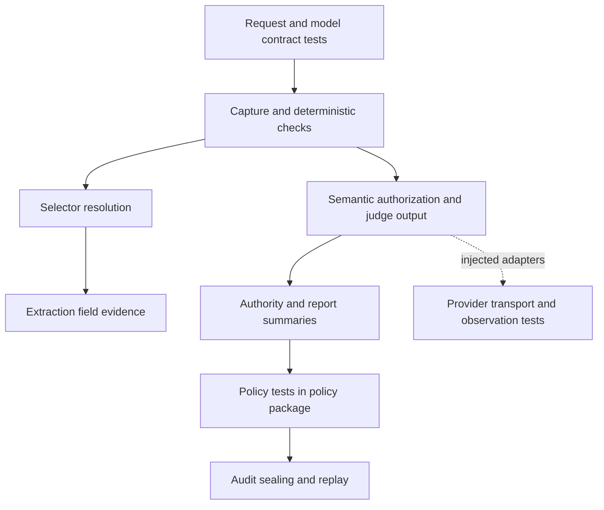

# Understanding the verification tests

Snapshot: 2026-09-11. This guide explains the current suite, the sequences it exercises and what its results mean. The [final implementation plan](CLEAN-CODE-RECOMMENDATION.md) governs the combined code/test work; [CLEAN-TESTING-RECOMMENDATION.md](CLEAN-TESTING-RECOMMENDATION.md) supplies detailed test improvements. Functions and interfaces are explained in [COMPREHENSION.md](COMPREHENSION.md).

## 1. What a passing suite tells us

The verification package currently passes **110 tests in 13 files**. The contracts package passes **85 tests in 25 files**. These full-package counts include compatibility, benchmark-publication and non-verification contract cases. They do not mean 195 independent verification promises: some tests exercise many cases, and `it.each` produces multiple runner cases from one declaration.

These tests establish behavior under controlled inputs. They do not establish the empirical accuracy of a live judge, authorize a deployment, prove a tenant's database permissions or show that a report contains every factual claim. Each of those belongs to another boundary or evaluation.

No line/branch coverage number is available: the coverage run stopped because `@vitest/coverage-v8` is missing. Baseline test scripts passed; coverage setup did not.

## 2. How to read a test

Most tests use Vitest's `describe`, `it` and `expect`:

```text
describe: which operation or rule are we explaining?
  arrange: build valid input and change the fact this case is about
  act: call the real function or composition
  assert: inspect the result, rejection or meaningful side effects
```

| Test term | Meaning in this repository |
| --- | --- |
| Fixture | A prepared source, bundle, schema, manifest or response. It supplies inputs; it should not dictate the result under test. |
| Stub / synthetic judge | Returns a specified judgment so the suite can check validation and orchestration. It is not demonstrating model reasoning. |
| Spy (`vi.fn`) | Records calls. Useful for proving the judge/provider/policy port was not invoked after a failed gate. |
| In-memory fake | Implements a capability using local maps or event records, such as artifact hydration. |
| Golden digest | A hard-coded expected hash that detects changes in retained result bytes. Investigate a mismatch before updating it. |
| Parameterized test (`it.each`) | Repeats one behavior for named input rows. Each row is independently reported. |
| Regression test | Protects a previously important failure, such as resolving mutable source evidence twice. |

Read the assertion after the test title. A title says what the author intended to prove; assertions determine what is actually protected. For example, a test that only checks `valid: false` may fail for the wrong reason and still pass.

## 3. Read the suite in the order verification happens



This is a **reading order**, not Vitest's execution order. Files can execute independently or concurrently. Each test must create its own prerequisites; the report or replay suite must not depend on another test having run first.

## 4. Current test-file map

All paths in this table are current files, not the proposed future split.

| File | Functions / sequence it exercises | What to look for |
| --- | --- | --- |
| [deterministic/deterministic.test.ts](src/deterministic/deterministic.test.ts) | `verifyDeterministicBundle`, canonicalization, decimal replay and built-in selectors | Pinned claim/metric result digests; capture corruption, projection binding, runtime identity, ambiguous evidence, metric graph failures, Unicode and decimal checks. |
| [selectors/resolvers.test.ts](src/selectors/resolvers.test.ts) | Canonical projection → `ProjectionSelectorResolver` → admitted resolver wrapper | HTML uniqueness/ranges, PDF/geometry, table headers/cells, transcript windows, repo paths, dataset/API identity and projection budgets. |
| [extraction/extraction.test.ts](src/extraction/extraction.test.ts) | Schema admission → candidate/field validation → accepted evidence leaves | Missing/null/additional fields, comparisons, totals, duplicates, resource limits, scalar source components and all-or-none leaves. |
| [semantic/verification.test.ts](src/semantic/verification.test.ts) | Mechanical fixture → `verifyAssertionSemantics` → synthetic judge | Closed gates, runtime case forgery, output consistency, cross-family judgment, cancellation/deadline and confidence semantics. |
| [semantic/diagnostics.test.ts](src/semantic/diagnostics.test.ts) | Decomposition, report summary, source authority, rescue and attribution | Useful domain tests gathered under a misleadingly broad semantic filename. Start here for report/authority behavior until tests are moved. |
| [providers/providers.test.ts](src/providers/providers.test.ts) | Fake HTTP response → provider adapter → sink → output validation | Interfaze task/schema modes and ZDR header, raw retention, actual HTTP status, malformed responses and Gateway tool policy. |
| [providers/gateway-semantic-observation.test.ts](src/providers/gateway-semantic-observation.test.ts) | Dispatch or retained bytes → observation recording → interpretation | Matched/missing/changed model evidence, accounting, persistence failure and tampered retained bytes. |
| [providers/semantic-judge.test.ts](src/providers/semantic-judge.test.ts) | Recorded output map / injected NLI classifier → adapter | Empty tool catalogs and categorical outputs; no actual model execution. |
| [provenance/provenance.test.ts](src/provenance/provenance.test.ts) | Fixture manifest → seal → inspect → hydrate/recompute → policy port | Authorization order, registered byte checks, lineage, signatures, policy input coverage and required semantic replay. |
| [provenance/attestation.test.ts](src/provenance/attestation.test.ts) | Signed audit → DSSE/SLSA statement → signed envelope → inspection | Builder/key binding, payload/statement tampering, signature rejection and public error sanitization. |
| [provenance/benchmark-publication.test.ts](src/provenance/benchmark-publication.test.ts) | Publication body → seal → verify | Actual signatures, unsigned versus verified state, binding validation and ownership across asynchronous signing. |
| [provenance/benchmark-comparison-publication.test.ts](src/provenance/benchmark-comparison-publication.test.ts) | Comparison publication → sign → verify | Signed result bindings and mutation protection. These test publication integrity, not benchmark quality. |
| [prototype-compat.test.ts](src/prototype-compat.test.ts) | Legacy locator/hash/arithmetic adapters | Historical compatibility behavior. Deferred from the recommended cleanup scope. |

### Adjacent contract suites

The [contracts verification directory](../contracts/src/verification/) tests wire and retained object shapes. Important groups:

| Files | Question they answer |
| --- | --- |
| `requests.test.ts`, `model.test.ts`, `verification.test.ts` | Does this request/model satisfy the schema? Are version, identity and bounded fields represented correctly? |
| `semantic-policy.test.ts` | Are judge, source and policy records consistent with their contracts? |
| `capture-reads.test.ts`, `parse.test.ts`, `extraction-field-evidence.test.ts` | Are source/parse/evidence resources correctly shaped and bound? |
| `structured-extraction-*.test.ts` | Do successful, failed and published extraction records preserve the required lifecycle/bindings? |
| `semantic-observation.test.ts`, `semantic-provider-reconciliation.test.ts`, `provider-reconciliation.test.ts` | Can retained provider observations and reconciliation states be represented without inventing authority? |
| `claims-report-reads.test.ts`, `audit-inspection.test.ts` | Are public result projections bounded and distinct from internal artifacts? |
| `adjudication.test.ts`, `adjudication-reads.test.ts` | Are review/decision resources constrained correctly? They do not authenticate the caller themselves. |
| `benchmark-*.test.ts` | Are benchmark definition/comparison records valid? Experiment caller migration remains deferred. |

One instructive example: [requests.test.ts](../contracts/src/verification/requests.test.ts) accepts a web-page capture request with `native_text`. The platform skill documents a narrower admitted capture path. That is a schema acceptance test, not proof the application accepts that request at runtime. A clearer title would state which boundary it tests.

## 5. Walkthrough: a mechanically checked claim

Current fixture: [prototype-parity.fixture.ts](src/deterministic/testing/prototype-parity.fixture.ts). Despite its name, this supplies production `DeterministicVerificationInput` to several suites.

```text
prototypeClaimInput()
  → source/capture handle + artifact bytes + assertion/evidence + runtime principals
  → verifyDeterministicBundle(input)
  → check status, eligibility, selector range and/or pinned result digest
```

For a negative case, the test changes a selector, capture digest or principal binding. The real engine still does the work. The strongest checks name the expected code, such as `EXPECTED_SELECTED_CONTENT_DIGEST_MATCH`, rather than only checking that something failed.

The metric fixture supplies observation dependencies as well. Existing cases replace an operand value, remove an observation, make a source-bound observation fail and create a cycle. These protect different rules but currently share a single test title. Splitting them would let the runner tell you immediately which rule regressed.

**How to diagnose a failure:** if many tests sharing `prototypeClaimInput()` fail before their assertion-specific stage, inspect the fixture's registration and result bindings first. Do not assume every downstream algorithm broke independently.

## 6. Walkthrough: extraction fields and accepted leaves

```text
schema(properties) helper
  → admitExtractionSchema
  → returned AdmittedExtractionSchema
source object → bytes + digest
candidate + field rules + evidence selectors + representation bytes
  → verifyExtractionFields / verifyExtractionFieldsWithEvidence
  → checks + valid flag (+ accepted leaves)
```

The current `verify` helper defaults source to candidate and constructs a schema from candidate keys. That is convenient for format/comparison cases. For a test claiming that evidence really supports a candidate, read whether it supplies a separate source. Otherwise both sides can accidentally agree by construction.

The large accepted-leaf test exercises several promises: raw versus normalized values, null, total metadata, freezing, duplicate totals, input mutation and empty accepted output on failure. Each is valuable. They need separate arrangements/names so changing one case cannot contaminate a later case in the same test.

The single-resolution test wraps a real projection resolver and counts calls. Here call count has domain meaning: rebuilding accepted evidence with a second resolution could bind different source content. It is not merely an implementation preference.

**Improvement overlay:** preserve the real selector/field interaction, split unrelated leaf promises, and make independent source bytes explicit in evidence tests.

## 7. Walkthrough: a judge that cannot bypass mechanics

```text
fixture builds claim and runs real mechanical verification
  → synthetic primary judge returns prewritten output
  → verifyAssertionSemantics
      → closed mechanical gate: assessment returned, judge never called
      → open gate: runtime authorization → judge → validate/reconcile output
```

The fake judge makes this deterministic and offline. Tests can intentionally return an invented fragment ID or inconsistent NLI label. Those are tests of output rejection, not evidence that a language model would make that judgment.

The `it.each` cases named “swapped entity,” “swapped algorithm,” “swapped count” and “swapped negation” all use a synthetic contradiction output. They prove the verifier records a supplied contradiction consistently; they do not measure the ability to detect those errors from prose. Keep that limitation visible in their names and documentation.

The current cross-family test checks a same-family second judge and a disagreeing independent judge. A separate different-family/same-deployment case would isolate the other independence condition. Cancellation/deadline checks use an aborted controller and an already-expired deadline, without sleeps.

**Improvement overlay:** assert the judge's actual received envelope for evidence isolation, and keep negative call assertions with the matching failed-gate result. Both observations express one behavior: the case is withheld from the judge.

## 8. Walkthrough: provider response custody

```text
construct adapter with injected fetch and artifact sink
  → submit bounded request
  → fake fetch returns Response
  → sink records response bytes / HTTP status
  → adapter interprets response or throws ProviderFailure
```

The Gateway observation suite records `request → raw → observation`. A model mismatch can be retained as evidence and then rejected. An HTTP 503 must stay an HTTP failure even when its body looks like successful output. This is why tests inspect the actual observed status separately from local schema validity.

Many fixtures use no-op sink methods. That is appropriate when persistence is incidental. It cannot prove persistence happened in the right order relative to dispatch. For ordering tests, include fetch in the event log and arrange a persistence failure; check fetch or result publication did not proceed.

**Improvement overlay:** retain these independent boundaries: transport status, raw-byte custody, observation, parsed output, and final verification quality. A single “provider failed” assertion would discard useful diagnostic information.

## 9. Walkthrough: seal and replay

```text
build valid mechanical result and retained policy inputs
  → build manifest and compute manifest digest
  → sealAuditBundle
  → inspectAuditBundle
  → replayAuditBundle with in-memory artifact resolver
      → authorize each artifact immediately before hydration
      → verify bytes and rerun deterministic checks
      → reconstruct recorded semantics when required
      → call injected policy replay
      → compare result/decision digests
```

The artifact resolver records calls; a test checks every hydration is immediately preceded by authorization for the same artifact. The policy port is synthetic: it returns a fixture decision. This tests replay orchestration and binding, not the real policy evaluator. For policy behavior, read [verification-policy.test.ts](../policy/src/verification-policy.test.ts).

One current tampering test returns bytes of a different length and expects `ARTIFACT_BYTE_LENGTH_MISMATCH`. That accurately protects length validation and the no-policy-call gate. It does not by itself prove equal-length hash tampering is detected; add that as a distinct case if not covered at the owning boundary.

Real Ed25519 key pairs are generated in-process for signature tests. This proves the crypto path executes without a live service. Distinguish invalid signatures from correctly signed statements with a wrong subject or dependency. Otherwise a signature rejection can hide a missing inner binding check.

**Improvement overlay:** keep one coherent successful seal/replay path and separate each failure gate. A failing golden digest is a signal to examine intended retained behavior, not permission to refresh snapshots blindly.

## 10. What belongs outside the algorithm suite

| Boundary | Nearby tests to inspect | Core tests cannot establish |
| --- | --- | --- |
| Registration / parser custody | [application admission](../application/src/verification-admission.test.ts) | Tenant ownership, persisted parentage and authorized parser execution. |
| Claims/report application flow | [application claims](../application/src/verification-claims.test.ts), [claims/report reads](../application/src/verification-claims-report-reads.test.ts) | Correct hydration of registered requests and authoritative public resources. |
| Provider reservation/ownership | [application provider](../application/src/verification-provider.test.ts) | Durable ownership before dispatch. |
| Policy admission | [policy tests](../policy/src/verification-policy.test.ts) | Final admission rules rather than synthetic policy return values. |
| Worker semantic stage / replay | [claims semantic stage](../../apps/worker/src/verification-claims-semantic-stage.test.ts), [sealed replay activity](../../apps/worker/src/verification-sealed-replay-activity.test.ts) | Worker orchestration, lifecycle and persisted execution behavior. |
| API identity and transport | [ownership](../../apps/api/src/verification-ownership.test.ts), [claims/report routes](../../apps/api/src/verification-claims-report-reads-routes.test.ts) | HTTP authorization and delivery of the right terminal resource. |

The executor's capture → locate → intent → judge → policy → seal → report sequence is another composition described in the module guide. The core suite passing does not mean that complete command chain was run. Add or run an executor-specific integration test when changing that boundary, using local deterministic dependencies where possible.

## 11. Commands and how to interpret them

Run from the `ai-engineer-knowledge-services` repository root. On this Windows workspace, `corepack.cmd` avoids shell command resolution issues.

```powershell
# Full package baselines, executed for this review:
corepack.cmd pnpm --filter @aiengineer/knowledge-verification test
corepack.cmd pnpm --filter @aiengineer/knowledge-contracts test

# Focused examples for working on existing files:
corepack.cmd pnpm --filter @aiengineer/knowledge-verification exec vitest run src/semantic/verification.test.ts
corepack.cmd pnpm --filter @aiengineer/knowledge-verification exec vitest run src/extraction/extraction.test.ts -t "accepted leaves"

# Relevant checks when implementing test/type changes (not run for this document):
corepack.cmd pnpm --filter @aiengineer/knowledge-verification typecheck
corepack.cmd pnpm --filter @aiengineer/knowledge-contracts typecheck

# Requires the matching coverage provider first; currently fails because it is missing:
corepack.cmd pnpm --filter @aiengineer/knowledge-verification exec vitest run --coverage --coverage.reporter=text
```

Verification runs `vitest run`; contracts runs `vitest run --passWithNoTests`. Neither package currently has its own Vitest configuration file. Their package exports point at built `dist` artifacts, so a core source test importing the contracts package may exercise its built export. If you change contracts, use the repository build/generation workflow before relying on downstream results; direct contract tests alone do not update the package build.

The contracts script's `--passWithNoTests` means a discovery mistake can appear successful with zero tests. Check file/test counts; the recommendation proposes removing that option for the established suite.

When a test fails, read the full suite/title, check that setup reached the target operation, inspect the relevant check/error and determine whether the mismatch concerns mechanics, semantics, transport or admission. If several unrelated cases share a failing fixture or built dependency, fix that common cause before changing their expected outputs.

## 12. How to participate in the cleanup

For any test you review, ask:

1. Can I explain its setup without opening several unrelated helpers?
2. Does its title name one outcome and the condition producing it?
3. Does its failing input differ from a valid input in the way the title describes?
4. Would the test fail if that specific validation or ordering rule were removed?
5. Is the expected answer independently known, or computed by the same algorithm?
6. Does the test establish only what this layer can know?

The recommendation's first implementation wave strengthens misleading or incomplete proofs, then splits and relocates cases. This preserves the suite's useful verification knowledge while making it possible to follow failures one behavior at a time.
